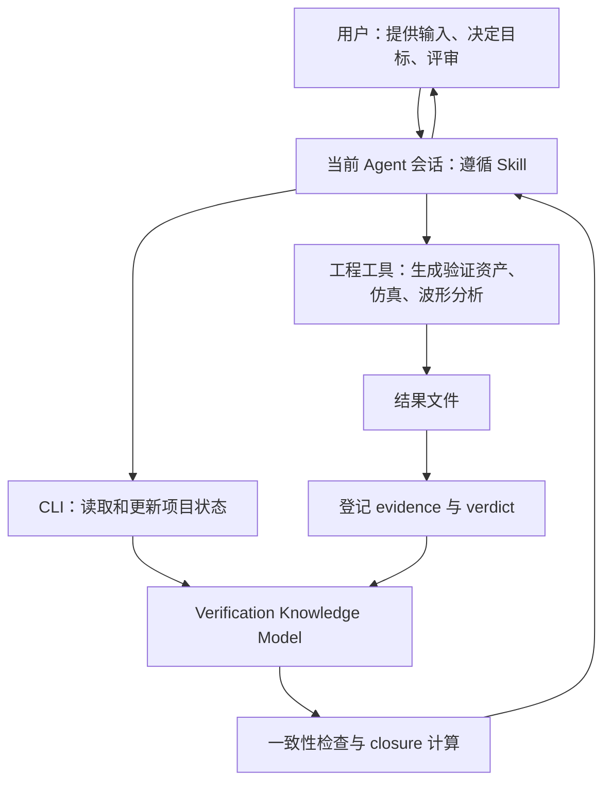

# verif-harness 工作机制

本文解释系统如何运转。具体操作见[用户指南](user_guide.md)，名词见[术语表](glossary.md)。

## 1. 谁在推动验证工作

用户在 Codex/Kimi 会话中表达目标，Agent 按 Skill 指令收集信息、调用 CLI 和工程工具。
CLI 把结构化状态写入项目，再返回当前缺口和建议动作。Agent 读取结果，继续执行授权内的
工作；涉及工程决策时在当前会话提问。下一条 CLI 调用读取磁盘状态，因此状态可以跨会话保存。

五个子系统是同一控制面中的职责划分，不代表五个独立 Agent 或五个常驻服务。
当前 CLI 一次调用处理一次操作；它没有自动轮询项目、无限执行任务的后台调度进程。



图中的返回路径由 Agent 的后续调用完成；“自动 closure”指一次写入后重新计算动作，
不表示系统自动执行这些动作。

## 2. 从用户目标到可评审计划

bootstrap 时，用户明确提供 `rtl root`、`dut top`、`dut top file`，`spec` 可选。
Skill 不搜索候选路径；必填信息未齐前先对话补齐。CLI 收到这些值后记录项目身份、
文件清单和工具能力，并创建或增量更新项目根 `AGENTS.md` 中唯一的 verif-harness
managed block。该区块先建立只读边界、事实源、交互授权和 VDOC fail-closed 路由；
项目已有说明保留在区块之外。所有 RTL、RTL spec 都是只读输入。
显式 RTL root、DUT top file 和 spec 可以位于 project root 外，届时以规范化绝对路径
登记并纳入只读 inventory；状态数据库、VDOC 文档和所有生成产物仍限制在项目内。

随后用户选择一个 [Workstream](glossary.md#workstream)，例如 VCHK（检查能力），
希望实现“输出事务在 backpressure 下仍正确匹配”。Verification Planner 的底层操作：

1. 取得该工作域的内置模板和当前知识模型上下文。
2. 保存 objective、required desired-state 节点、exit criteria 和已记录的 decisions。
3. 创建新 revision，把该工作域置为 `REVIEW`，生成 JSON/Markdown 阅读投影。
4. 返回 proposal 和供对话使用的问题。

具体项目分析和问题筛选由当前 Agent 完成。CLI 本身提供模板和上下文，不自动理解 RTL，
也不自行对话。Human 在会话中确认后，Agent 执行 review，审批记录绑定该 Workstream
的当前 revision。approve 表示接受目标，尚不代表目标已实现。

VDOC 默认目标逐份关联八个正式验证文档及其通用模板，包括一份不含 Stage/Spec Kit
语义的 `verification_workflow.md` 文档治理合同；当前 Agent 按
[文档产出规则](../vplan/vdoc.md)进行对话填充。CLI 的 `plan.md` 仅列目标，
正式验证计划、验证点矩阵和各专题设计是独立的工程语义源。`plan VDOC` 只创建缺失模板，
不覆盖已有文档，同时把路径、摘要、semantic revision 和 desired 关系登记到 SQLite。
VDOC 规划还会把确认的文档根和八份路由写回同一个 `AGENTS.md` managed block。
后续 VCHK、VCOV 等工作域按影响范围修订文档，不要求首次规划时全部完成。

正文改变后，Agent 调用 `docs sync`；Engine 通过摘要变化传播失效。文档状态、决策事项
生命周期、Review Trace、Human Review Notes 和 Revision Log 保存在 SQLite，通过
`docs status` 或 `docs render` 按需查看，默认不写回工程语义正文。Human 审批具体正文后，
Agent 调用 `docs review`，将审批绑定到当前摘要和 revision；VDOC freeze 同时快照已评审正文。

## 3. 如何决定下一步

[Current state](glossary.md#desired-current) 来自节点有效性与 finding；
Verification Closure Engine 将它与 required desired state 对比，生成 [action](glossary.md#gap-action)。
当前实现按明确规则排序，优先级数字越小越靠前：

| 触发条件 | action kind | executor | priority |
| --- | --- | --- | --- |
| Workstream 为 REVIEW/REVISE | HUMAN_REVIEW | human | 1 |
| Workstream 节点有 OPEN finding | RESOLVE_FINDING | reasoning | 5 |
| required 节点为 STALE/REVALIDATION_REQUIRED | REVALIDATE | deterministic | 10 |
| required 节点为 INVALID/BLOCKED | REPAIR_OR_REPLAN | reasoning | 10 |
| required 节点为其他未满足状态 | SATISFY_DESIRED_STATE | reasoning | 10 |

`VALID/WAIVED` 的 required 节点不产生缺口动作。全局 closure 汇总各工作域动作；
它不是成本最优任务调度器，也不按完成百分比挑选工作。`suggested_mode` 只是建议能力，
并不代表已执行或已获得授权。

没有剩余动作时，closure 返回 `ready=true`，符合条件的 ACTIVE/PARTIALLY_STALE
工作域可转为 `SATISFIED`。`status` 做只读计算；显式 closure 和相关写入会保存计算结果。

## 4. 工程动作怎样成为证据

以 checker targeted test 为例：

| 时刻 | 工程动作 | 控制面中的变化 |
| --- | --- | --- |
| 规划 | 定义“backpressure 下比较正确” | desired 节点 UNKNOWN，工作域 REVIEW |
| 评审 | 用户接受目标 | 工作域 ACTIVE，目标仍需证明 |
| 实现与运行 | Agent 修改验证代码、调用工具 | 产生 checker 和测试结果文件；目标不会仅凭聊天描述变为 VALID |
| 登记 | 将结果文件绑定到 desired 节点 | 保存 source、kind、digest、verdict；pass 将目标置为 VALID，fail 置为 INVALID |
| 收敛 | 重新计算 closure | 未满足目标继续产生动作，全部满足后可申请 freeze |

当前 `prove` 检查文件存在、目标存在，并计算文件摘要；它接受调用方的 pass/fail verdict，
不会自行解析任意报告并证明工程结论。Agent/adapter 必须先检查真实结果，再登记 verdict。
摘要记录文件内容的指纹，不等于证据语义正确，也不等于持续检查文件是否被改动。

文字 exit criteria 和 decisions 是供评审使用的记录。当前 closure 没有把所有自然语言
退出标准转成可执行检查；必须把需要机器阻塞的条件落实为 required 节点及相关证据。

## 5. 依赖怎样传播失效

知识模型用 node 表示对象，用有向 edge 表示关系。当前 `impact` 和 `changed` 沿
已记录的 `source → target` 出边遍历，不能发现未登记的依赖；遍历不会按 relation
名称或 confidence 阈值筛选边。因此建边时必须明确方向与传播范围。

例如已登记如下影响链（示意，节点 ID 由实际项目决定）：

```text
RTL 文件 → VCHK 检查目标 → VREG 回归目标
```

当用户在外部修改 RTL 后，Agent 登记 change：

1. 变化文件标为 `STALE`；删除事件标为 `INVALID`。
2. 出边可达节点标为 `REVALIDATION_REQUIRED`，并生成关联该事件的 finding。
3. 受影响的已活跃或已冻结工作域进入 `PARTIALLY_STALE`。
4. closure 产生处理 finding 和重新验证的动作；Agent 执行后登记新证据。

`changed` 登记的是输入已变化这一事实，绝不授权 Agent 修改 RTL/spec。
当前没有常驻文件 watcher；`check` 主要检查已登记文件是否缺失，也不替代主动登记内容变化。

## 6. 为什么可以跨工作域反复迭代

Workstream 是目标的归属上下文，不是必须顺序通过的阶段。例如 VCOV 发现 hole 后，
可能需要 VSTIM 补激励、VCASE 补用例，再由 VREG 运行获得证据。局部目标可以在任意时刻修订。

重新 plan 会创建新的 desired revision，旧 desired 节点被标为 STALE，当前工作域回到
REVIEW。新 revision 需要再次评审与证明；不能因为上一个 revision 已通过就直接宣告完成。
当前计划行会更新，旧节点、评审记录及已经创建的 baseline 保留；不要假设每个未冻结
revision 都有完整的历史文档快照。

## 7. 人工决策和推理在何处介入

确定性动作交给工具，例如按已知配置运行测试、读取结果。无法确定数值容差、规格含义、
失败归属等问题时，Agent 组织上下文并提出分析或问题。Verification Reasoning Engine 的
`reason` 命令当前只输出结构化请求（`executed=false`）；它不启动另一套后端进程。

review、waiver 和 freeze 属于 [Human gate](glossary.md#human-gate)。用户在对话中作决定，
Agent 只能按明确指示记录。reviewer 自动填充是审计便利，不是身份认证，也不赋予 Agent
替人批准的权限。只读 RTL/spec 约束同样属于当前 Agent 必须遵守的 Skill 规则；CLI
不是一个能隔离外部编辑器的文件系统权限系统。

## 8. freeze 到底冻结什么

Workstream freeze 要求已 approve 且局部 closure 无剩余动作，然后创建带摘要的 baseline
manifest，记录该工作域的计划、相关节点、边、finding、evidence 和 reviewer/reason。
final freeze 要求六个工作域均为 BASELINED，且审计没有 OPEN finding 或缺失文件。

baseline 是控制面快照；当前实现不会复制所有 RTL、波形、报告，也不会把工作目录设成只读。
报告文件和源码版本仍需项目自身保留。freeze 不表示真实世界的全部功能已验证，也不授予
公开发布权限。以后出现变化时继续修订当前状态，并创建新 baseline，保留旧快照。

实现核对入口：[状态与存储](../../../verif_harness/store.py)、
[CLI 分发](../../../verif_harness/cli.py)、[bootstrap 对话规则](../bootstrap/INSTRUCTIONS.md)。
