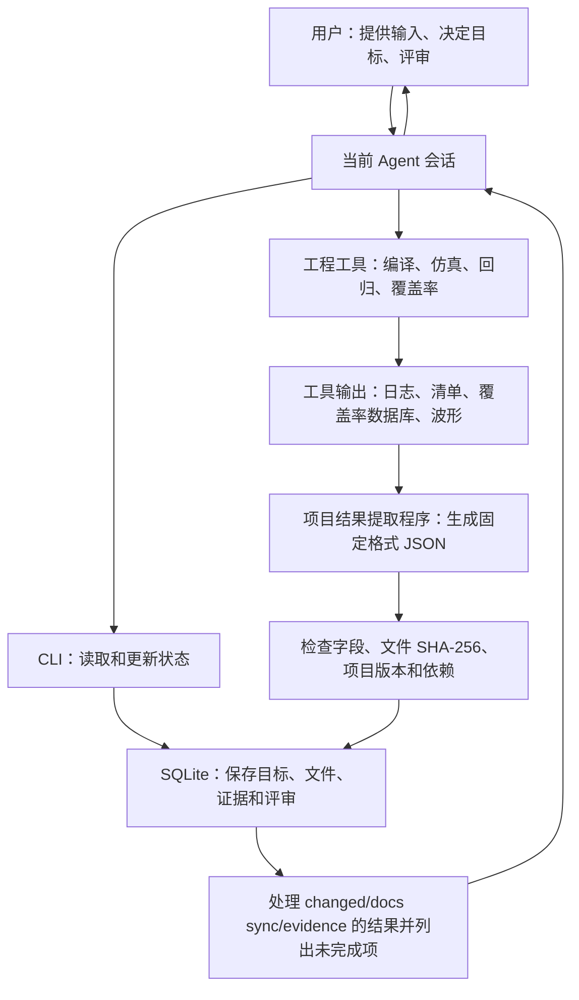

# verif-harness 工作机制

本文解释系统如何运转。具体操作见[用户指南](user_guide.md)，名词见[术语表](glossary.md)。

## 1. 谁在推动验证工作

用户在 Codex/Kimi 会话中表达目标，[Agent](glossary.md#control-plane) 按
[Skill](glossary.md#control-plane) 指令收集信息、调用 [CLI](glossary.md#control-plane) 和工程工具。
CLI 把状态写入项目，再返回当前缺少什么和建议做什么。Agent 读取结果，继续执行用户已经
明确同意的工作；涉及工程决定时在当前会话提问。下一条 CLI 调用重新读取磁盘状态，因此
关闭会话后这些状态仍然保留。

五个[子系统](glossary.md#subsystems)是同一控制面中的职责划分，不代表五个独立 Agent
或五个常驻服务。
当前 CLI 一次调用处理一次操作；它没有自动轮询项目、无限执行任务的后台调度进程。



图中的返回路径由 Agent 的后续调用完成；“自动检查完成条件”只表示系统会重新列出还缺什么，
不表示系统自动执行这些动作，也不表示启动了 [worker](glossary.md#gap-action)。

## 2. 从用户目标到可评审计划

bootstrap 时，用户明确提供 `rtl root`、`dut top`、`dut top file`，`spec` 可选。
Skill 不搜索候选路径；必填信息未齐前先对话补齐。CLI 收到这些值后记录项目身份、
文件清单和工具能力，并创建或增量更新项目根 `AGENTS.md` 中唯一的 verif-harness
managed block。该区块先说明哪些文件只读、信息从哪里读取、哪些操作需要 Human 明确同意，
以及 VDOC 条件不足时应停止在哪一步；
项目已有说明保留在区块之外。所有 RTL、RTL spec 都是只读输入。
显式 RTL root、DUT top file 和 spec 可以位于 project root 外，届时以规范化绝对路径
登记并纳入只读 inventory；状态数据库、VDOC 文档和所有生成产物仍限制在项目内。

随后用户选择一个 [Workstream](glossary.md#workstream)，例如 VCHK（检查能力），
希望实现“输出事务在 backpressure 下仍正确匹配”。Verification Planner 的底层操作：

1. 读取该工作域的内置模板和项目已经保存的信息。
2. 保存本轮总体目标、必须达到的具体目标、退出条件和已确认决定。
3. 创建一个新版本，把该工作域置为 `REVIEW`，并生成供人阅读的 JSON/Markdown。
4. 返回[待评审方案](glossary.md#desired-current)和需要在对话中回答的问题。

具体项目分析和问题筛选由当前 Agent 完成。CLI 本身提供模板和已保存的项目信息，不自动理解 RTL，
也不自行对话。Human 在会话中确认后，Agent 执行 review，审批记录绑定该 Workstream
的当前版本。`approve` 表示接受“准备做什么”，尚不表示相关实现或测试已经完成。

VDOC 默认目标逐份关联八个正式验证文档及其通用模板，包括一份不含 Stage/Spec Kit
内容的 `verification_workflow.md` 文档管理说明；当前 Agent 按
[文档产出规则](../vplan/vdoc.md)进行对话填充。CLI 的 `plan.md` 仅列目标，
正式验证计划、验证点矩阵和各专题设计是工程师应直接阅读和修改的正式文档。`plan VDOC` 只创建缺失模板，
不覆盖已有文档，同时把路径、文件 SHA-256、文档内容版本和目标关系登记到 SQLite。
VDOC 规划还会把确认的文档根和八份路由写回同一个 `AGENTS.md` managed block。
后续 VCHK、VCOV 等工作域按影响范围修订文档，不要求首次规划时全部完成。

正文改变后，Agent 调用 `docs sync`；Engine 比较文件 SHA-256，并把依赖旧内容的结论标为
需要重新验证。SQLite 保存文档状态、待处理问题和决定、评审历史及修改记录；用户通过
`docs status` 或 `docs render` 查看，默认不写回验证文档正文。Human 审批具体正文后，
Agent 调用 `docs review`，把评审绑定到当前文件 SHA-256 和版本；VDOC freeze 同时保存一份
已评审正文快照。

## 3. 如何决定下一步

[Current state](glossary.md#desired-current) 来自节点有效性与 finding；
Verification Closure Engine 将它与 required desired state 对比，生成 [action](glossary.md#gap-action)。
当前实现按明确规则排序，优先级数字越小越靠前：

| 触发条件 | action kind | executor | priority |
| --- | --- | --- | --- |
| Workstream 为 REVIEW/REVISE | HUMAN_REVIEW | human | 1 |
| Workstream 节点有 OPEN finding | RESOLVE_FINDING | reasoning | 5 |
| required 节点为 STALE/REVALIDATION_REQUIRED | REVALIDATE | deterministic | 10 |
| required 节点为 INVALID/BLOCKED | REPAIR_OR_REPLAN | reasoning | 10 |
| required 节点为其他未满足状态 | SATISFY_DESIRED_STATE | reasoning | 10 |

`VALID/WAIVED` 的 required 节点不再产生待办项。全局 closure 汇总各工作域还缺什么；
它不会按成本或完成百分比自动安排任务。`suggested_mode` 只是建议使用哪个工具，
不表示动作已经执行，也不表示 Human 已经同意某个需要确认的操作。

没有剩余动作时，closure 返回 `ready=true`，符合条件的 `ACTIVE/PARTIALLY_STALE`
工作域可转为 `SATISFIED`。这些[状态](glossary.md#workstream)只描述计划和证据是否满足条件，
不表示后台进程是否在运行。`status` 只读取和计算；显式 closure 和相关写入会保存结果。

## 4. 工程动作怎样成为证据

以 checker targeted test 为例：

| 时刻 | 工程动作 | 控制面中的变化 |
| --- | --- | --- |
| 规划 | 定义“backpressure 下比较正确” | 目标尚未证明，正在等用户确认 |
| 评审 | 用户接受目标 | 可以开始实现，但目标仍未证明 |
| 实现与运行 | Agent 修改验证代码、调用工具 | 产生源文件、编译/仿真日志、回归清单或覆盖率数据库；聊天中的“已经完成”不会改变目标状态 |
| 提取 | 项目结果提取程序读取工具输出 | 生成包含 JSON 格式版本、要证明的内容、项目版本、原始文件 SHA-256 和运行事实的报告 |
| 登记 | 将 JSON 报告关联到目标 | 自动校验程序生成 PASS/FAIL；PASS 把目标置为 `VALID`，FAIL 置为 `INVALID` |
| 检查完成条件 | 重新运行 `closure` | 未满足目标继续显示为待办项；全部满足后才允许请求 freeze |

标准 VSTIM/VCHK/VCOV/VCASE/VREG desired node 使用 `evidence`：它按 Workstream 读取专用
[schema](glossary.md#evidence-format)、执行该 claim 的[自动校验](glossary.md#evidence-format)，
并从内容生成 verdict，通用入口不能绕过。
格式错误不登记；格式正确但没有达到工程条件时登记 FAIL。VDOC 使用绑定正文文件指纹的
`docs review`。通用 `prove` 只用于没有标准证据格式的自定义目标，并接受调用方给出的 verdict。
SHA-256 只确认文件内容是否变化，不代表功能正确，也不表示系统正在持续监控文件。

工具[原始输出](glossary.md#evidence-source)与系统能够登记为验证结论的证据不是同一个概念：编译成功通常只支持
capability；仿真日志中的非零 comparison、零 mismatch、scenario accepted 等运行事实支持
closure-evidence；VDB/UCDB 需要先导出覆盖项、命中次数、合并结果和排除项；波形主要用于
调试或补充说明。当前控制面尚未提供支持所有仿真器的通用 log/VDB/UCDB 解析程序，由项目
工具或 adapter 生成固定格式 JSON；不能让 Agent 用自然语言“阅读后宣布 PASS”。

所有标准 JSON 使用[公共字段](glossary.md#evidence-format)：`schema` 标识格式版本，`claim`
标识要证明的内容，`revision` 绑定项目状态，`tool` 记录生产程序，`artifacts[]` 用项目相对
路径和 SHA-256 绑定原始文件，`result` 保存 Workstream 专用事实。VSTIM reachability 使用
同等严格的专用格式，
其中 producer 和 observation boundary 另有固定约束。

文字 exit criteria 和 decisions 是供评审使用的记录。当前实现不会任意解释自然语言，
因此需要机器阻塞的条件必须落实为 required node、Planner dependency、专用 validator 或
[自动退出检查](glossary.md#evidence)。四者共同决定 Workstream 是否能够进入 `SATISFIED`。

## 5. 一个文件修改后，系统怎样找出需要重新验证的目标

知识模型用 [node](glossary.md#knowledge) 表示目标、文件或证据，用 edge 记录它们之间的关系。
普通影响关系按 `source → target` 表示；`DEPENDS_ON` 保存为“当前节点 → 它依赖的节点”。
Agent 登记具体文件变化后，系统会从被依赖节点找到需要重新验证的下游节点。系统无法发现没有登记的
项目专用依赖，因此自定义关系必须明确登记。

标准模板把目标分为[能力节点和运行证据节点](glossary.md#node-role)。Planner 每次 plan/replan
都会把默认依赖连接到各 Workstream 的当前版本。前置目标尚未规划时，Closure 返回
`PLAN_PREREQUISITE`；已经规划但还没满足时返回 `WAIT_FOR_DEPENDENCY`。它只等待具体节点，
不会要求另一个 Workstream 整体完成。手工登记依赖时，CLI 会拒绝循环依赖。

证据登记也检查同一组前置目标。报告格式和内容本身正确，但前置目标尚未满足时，报告会被保留为 FAIL，
待依赖满足后重新运行；旧证据不会因依赖状态变化而被自动升级。

退出条件不只看单个节点状态。Closure 还会检查：VDOC 是否仍有未回答的人工问题；VSTIM
计划的场景是否有对应生成组件和到达 DUT 的记录；VCHK 运行日志是否来自当前检查器版本；
VCASE 计划的每个用例是否已经实现和运行；VREG 每个失败是否都有对应分析；以及所有必需
运行证据是否属于当前项目版本。任一项失败都会返回 `EXIT_CRITERION_BLOCKED`。

VSTIM 的基础可达性采用自身 probe，不依赖完整 coverage model 或 assertion checker；它只
依赖 VDOC 的具体合同、自己的 stimulus capability 和 VREG 的 `executor-ready` capability。

例如已登记如下影响链（示意，节点 ID 由实际项目决定）：

```text
RTL 文件 → VCHK 检查目标 → VREG 回归目标
```

当用户在外部修改 RTL 后，Agent 登记 change：

1. 修改过的文件标为 `STALE`；已删除的文件标为 `INVALID`。
2. 通过已登记关系受其影响的目标标为 `REVALIDATION_REQUIRED`，并生成一个待处理问题。
3. 受影响的已活跃或已冻结工作域进入 `PARTIALLY_STALE`。
4. closure 产生处理 finding 和重新验证的动作；Agent 执行后登记新证据。

`changed` 只记录输入已经变化，绝不表示 Agent 可以修改 RTL/spec。
当前没有常驻文件 watcher。`check` 会同步已登记 VDOC 文档的 SHA-256，并检查已登记文件是否
缺失；其他文件内容修改仍需 Agent 主动调用 `changed PATH`。

## 6. 为什么可以跨工作域反复迭代

Workstream 只是把同类目标放在一起，不是必须顺序通过的阶段。例如 VCOV 发现未覆盖项后，
可能需要 VSTIM 补激励、VCASE 补用例，再由 VREG 运行获得证据。局部目标可以在任意时刻修订。

重新 plan 会创建新的 desired revision，旧 desired 节点被标为 STALE，当前工作域回到
REVIEW。新 revision 需要再次评审与证明；不能因为上一个 revision 已通过就直接宣告完成。
当前计划行会更新，旧节点、评审记录及已经创建的 baseline 保留；不要假设每个未冻结
revision 都有完整的历史文档快照。

## 7. 人工决策和推理在何处介入

能按固定输入和规则完成的动作交给工具，例如按已知配置运行测试、读取结果。无法确定数值容差、
规格含义、失败来自 DUT 还是验证环境时，Agent 整理与问题相关的文件、日志和已知事实，再提出
分析或问题。Verification Reasoning Engine 的 `reason` 命令当前只输出字段固定的分析请求
（`executed=false`）；它不启动另一个 Agent 或后台进程。

review、waiver 和 freeze 属于 [Human gate](glossary.md#human-gate)。用户在对话中作决定，
Agent 只能按明确指示记录。reviewer 自动填充是审计便利，不是身份认证，也不赋予 Agent
替人批准的权限。只读 RTL/spec 约束同样属于当前 Agent 必须遵守的 Skill 规则；CLI
不是一个能隔离外部编辑器的文件系统权限系统。

## 8. freeze 到底冻结什么

Workstream freeze 要求当前计划已批准且没有未完成项，然后创建一份带 SHA-256 的
[baseline 清单](glossary.md#baseline)，记录本轮计划、目标、依赖、未决问题、证据和评审人/
原因。final freeze 要求六个工作域都已经分别冻结，而且检查结果中没有未处理问题或缺失文件。

baseline 是控制面快照；当前实现不会复制所有 RTL、波形、报告，也不会把工作目录设成只读。
报告文件和源码版本仍需项目自身保留。freeze 不表示真实世界的全部功能已验证，也不授予
公开发布权限。以后出现变化时继续修订当前状态，并创建新 baseline，保留旧快照。

实现核对入口：[状态与存储](../../../verif_harness/store.py)、
[CLI 分发](../../../verif_harness/cli.py)、[bootstrap 对话规则](../bootstrap/INSTRUCTIONS.md)。
