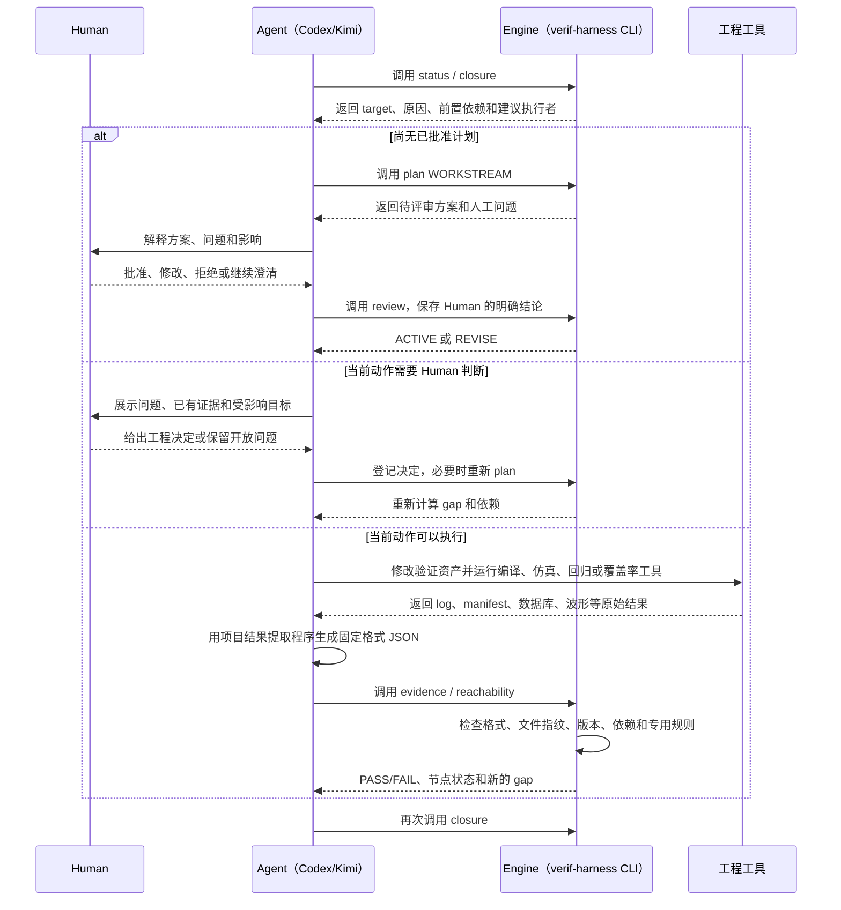
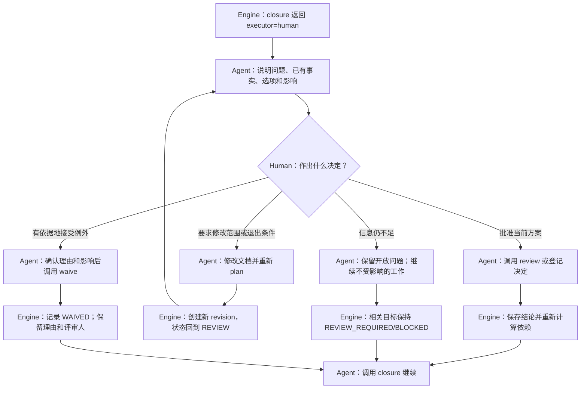
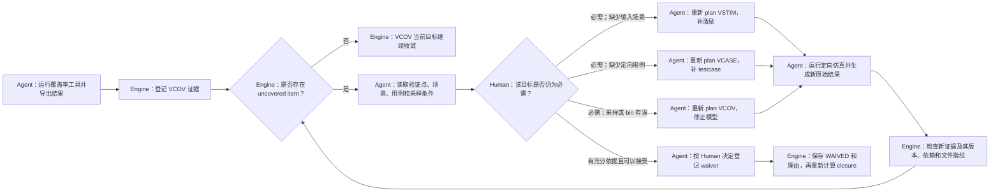
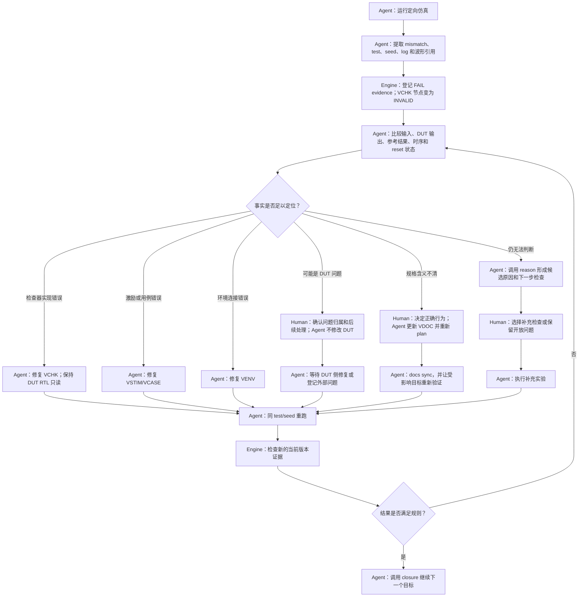
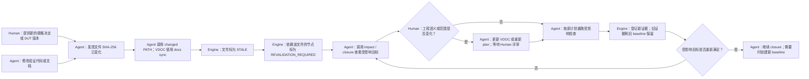
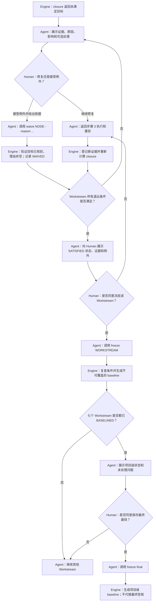

# verif-harness v1 用户指南

本文只讲安装和操作。项目定位、适用对象与治理理念见仓库
[README](../../../README.md)，内部边界见[架构说明](../../../ARCHITECTURE.md)。
理解一次操作如何推动状态变化，请先读[工作机制](mechanism.md)；不熟悉的名词可查
[术语表](glossary.md)。

## 1. 两种入口

### 1.1 在 Agent 会话中使用（推荐）

[setup 和 workspace](glossary.md#project-setup) 准备完成后，setup 会自动切换到指定 workspace，
并启动选定的
[Agent](glossary.md#control-plane)，无需再次手动启动。进入会话后，[Human（用户）](glossary.md#control-plane)只需激活
[Skill](glossary.md#control-plane) 并用自然语言说明目标：

- Codex：对话中输入 `$verif-harness`，再说明目标；
- Kimi：对话中输入 `/skill:verif-harness`，再说明目标。

Human 不需要直接运行 `verif-harness plan/review/evidence/freeze` 等底层命令，也不需要记忆
它们的参数。Skill 激活后，Agent 先读取当前状态、提出需要 Human 回答的问题；Human
通过对话给出目标、工程决定或审批结论；Agent 再自行调用底层
[CLI](glossary.md#control-plane)，将结果保存到
[Verification Knowledge Model](glossary.md#subsystems)。标准交互关系是：

```text
Human：激活 Skill，并用自然语言说明目标
  ↓
Agent：读取状态，调用 CLI，生成待评审方案或文档初稿
  ↓
Human：回答问题，作出 approve/modify/clarify/reject 等决定
  ↓
Agent：根据明确回答继续调用 CLI 并报告结果
```

首次使用时，Human 可输入“`$verif-harness 为当前项目开始验证治理`”（Codex）或
“`/skill:verif-harness 为当前项目开始验证治理`”（Kimi）。Agent 发现项目尚未
bootstrap 后，会询问必填 [DUT 信息](glossary.md#project-setup)，并自行调用
[`bootstrap`](glossary.md#project-setup) 建立项目知识模型。
只有传入 `--no-agent` 时 setup 才跳过启动；之后重新运行不带该参数的 setup 即可进入会话。

例如：“`$verif-harness 规划 VDOC，并只询问模型无法确定的决策`”。Agent 会读取
Skill 约束，再调用项目级 CLI。[Human review、waiver](glossary.md#human-gate) 和
[freeze](glossary.md#baseline) 必须由用户明确要求，
Agent 不得自行批准。

### 1.2 底层 CLI（Agent/CI 接口）

下文命令统一写成：

```text
verif-harness COMMAND
```

它代表 setup 创建的 Skill launcher：

```text
# Codex workspace
.agents/skills/verif-harness/scripts/verif-harness COMMAND

# Kimi workspace
.kimi-code/skills/verif-harness/scripts/verif-harness COMMAND
```

在 verif-harness 源码仓内开发时也可以运行：

```text
scripts/managed-python scripts/verif_harness.py COMMAND
```

CLI 输出字段固定的 JSON，便于 Agent 和 CI 读取；人工通常只需关注 `status`、`actions`、
`questions_for_human`、`findings`、`evidence` 与 `baseline`。用户指南保留命令块是为了
解释 Agent 实际执行了什么，以及方便 CI/高级诊断；它们不是要求 Human 在正常对话流程中
手工输入。Human 也可以在终端直接调用 CLI，但直接调用表示调用者自行承担参数、项目范围
和操作责任，不能让 Agent 把 CLI 的默认值当作 Human 决定。

## 2. 安装、runtime、依赖与 MCP

本节涉及的 [runtime、backend 和 MCP](glossary.md#runtime) 含义见术语表。

从已审核的 verif-harness [checkout（Git 工作副本）](glossary.md#project-setup)执行一次：

```text
./scripts/setup --runtime codex --workspace-root /path/to/project
# 或
./scripts/setup --runtime kimi --workspace-root /path/to/project
```

setup 会：

1. 在 verif-harness 自身的 `.deps/` 下建立受管 Python 环境；
2. 安装并校验 Python、xverif、WavePeek 等锁定依赖；
3. 向目标 workspace 安装项目级 Skill 链接与中文响应配置；
4. 为选定的 Codex/Kimi runtime 配置项目级 xverif MCP；
5. 切换到 workspace 后启动选定 Agent。

[`runtime`、`dependency`、`backend`](glossary.md#runtime) 是三个不同概念：

| 概念 | 含义 |
| --- | --- |
| Agent runtime | 当前交互宿主：Codex 或 Kimi |
| managed dependency runtime | verif-harness 管理的 Python 与隔离依赖，位于 Git-ignored `.deps/` |
| execution backend | xverif 的 direct/调度器执行方式，或 Verification Reasoning Engine 选择的 Codex/Kimi/Claude 推理后端 |

setup 参数：

| 参数 | 默认值 | 说明 |
| --- | --- | --- |
| `--workspace-root PATH` | verif-harness 源码根目录 | 要管理并启动 Agent 的项目目录；旧拼写 `--project-root` 仍兼容 |
| `--runtime codex\|kimi` | `auto` | 选择 Agent；两者同时安装且要启动时必须明确选择 |
| `--install-verilator` | 关闭 | 缺少 Verilator 时尝试通过 Homebrew/apt 安装 |
| `--isolation managed` | `managed` | 依赖隔离实现；当前只支持 managed |
| `--no-agent` | 关闭 | 只安装/配置，不启动 Agent |

setup 已经知道 workspace 和 runtime，所以后续在项目根目录执行 CLI 时不需要重复传
`--project-root` 或 `--runtime`。xverif MCP 注册也由 setup 完成；Agent 刚启动、MCP
握手尚未结束时可能显示 `configured, connection pending`，不能据此判断未安装。

只读确认：

```text
verif-harness runtime status
verif-harness xverif mcp status --project-root .
verif-harness doctor
```

## 3. 从空项目到保存最终基线（final freeze）

下面是第一次使用时最容易理解的顺序，不是强制流水线。任何 Workstream 都可以并行、
跳转、修订或重新打开。

### 步骤 0：建立项目模型

这一步就是[Bootstrap](glossary.md#project-setup)：登记用户明确提供的 RTL/DUT/spec 路径，
创建项目状态库和 `AGENTS.md` 说明，不生成完整 testbench。

setup 已自动进入 workspace 并启动 Agent。在会话中发起 bootstrap：

```text
# Human：在 Codex/Kimi 对话中输入；这不是 shell 命令
$verif-harness bootstrap
# Kimi 使用 /skill:verif-harness bootstrap
```

Agent 必须通过对话要求用户明确提供以下输入，不搜索候选目录、不猜测或自行选择 DUT：

| 对话输入 | 是否必填 | 含义 |
| --- | --- | --- |
| `rtl root` | 必填 | RTL 根目录 |
| `dut top` | 必填 | DUT 顶层模块名 |
| `dut top file` | 必填 | DUT 顶层源文件路径 |
| `spec` | 可选 | RTL 规格文件或目录；可以不提供 |

本次对话已明确提供的字段不重复询问；缺失必填字段时先等待用户补齐，不执行初始化。
Agent 只读校验用户给定的路径，然后将回答转为底层 CLI 参数。以下是 Agent 的执行示例，
用户无需手动拼接参数；可选 spec 使用现有 `--docs-root` 接口传入：

```text
# Agent：根据 Human 已明确提供的信息调用 CLI；Human 无需手工拼接参数
verif-harness bootstrap \
  --rtl-root rtl --docs-root docs --verif-root verification \
  --dut-top dut --dut-top-file rtl/dut.sv
```

RTL root、DUT top file 和 spec 不要求位于 workspace/project root；用户显式给出的项目外
路径会以绝对路径记录。DUT top file 必须位于至少一个已声明 RTL root 内。这些路径名的
含义见[项目路径和启动相关词](glossary.md#project-setup)。
`verif-root`、`.verif-harness/`、`AGENTS.md` 和所有生成产物则必须留在 project root 内。
因此可以让独立 verification workspace 引用另一个 RTL 仓库，而不会把 RTL 复制进来。

所有 RTL 和 RTL spec 均为当前 Agent 的只读输入，不允许编辑、生成覆盖、删除、移动或
格式化，也不得通过工具间接更改。发现输入问题时报告用户处理；验证产物必须放在独立路径。
bootstrap 同时创建或增量更新项目根目录 `AGENTS.md` 的 verif-harness managed block，
写入 DUT 身份、哪些文件只读、Human/Agent/Engine 的分工，以及“验证文档未就绪时先返回
VDOC”的规则。已有项目说明保留在 verif-harness 标记之外，不会被覆盖。该区块还说明：
验证设计写在 Markdown，文件版本、评审和证据状态保存在 SQLite。初始化后可用 `status`
和 `doctor` 检查项目状态。

这一步的角色边界是：

- **Human**：明确提供 workspace、RTL root、DUT top、DUT top file 和可选 spec；决定输入错误
  应如何处理。Human 不需要手工创建 SQLite 或 `AGENTS.md`。
- **Agent**：在当前对话收集必填信息，只读检查路径和 DUT 身份，然后调用 `bootstrap`；不得搜索
  候选 DUT，也不得修改 RTL 或 RTL spec。
- **Engine**：检查参数和路径约束，创建项目状态库、工作目录及 `AGENTS.md` managed block；只保存
  已明确提供的项目事实，不猜测 DUT 含义。

### 步骤 1：确定 VDOC 本轮要完成的文档目标

```text
# Agent：调用 CLI 建立并查看 VDOC 待评审方案；Human 无需手工输入
verif-harness plan VDOC
verif-harness status VDOC
```

Verification Planner 读取 VDOC 通用模板、项目已经登记的信息和现有文件，生成一份
[待评审方案](glossary.md#desired-current)和 `questions_for_human`。方案会列出本轮要完成的
文档、每份文档需要达到什么状态、哪些问题必须由 Human 回答。Agent 在当前会话解释这些
问题并收集回答；CLI 不会自己理解规格含义。需要修改方案时再次运行 `plan VDOC`，创建新版本。

Agent 展示 proposal 后，Human 在对话中明确表达评审结论，例如：

```text
# Human：在当前 Agent 对话中表达；这不是 CLI 命令
批准当前 VDOC 范围。
```

Agent 收到 Human 的明确同意后，才自行执行底层命令并保存结论：

```text
# Agent：仅在收到上面的 Human 明确同意后调用 CLI
verif-harness review VDOC --verdict approve
```

当且仅当只有一个 Workstream 等待评审时，Agent 才可以在底层调用中省略目标；默认
verdict 是 `approve`，reviewer 从 `git user.name` 推导。CLI 默认值不代表 Human 已经同意，
Agent 仍必须先取得明确结论。Human 拒绝或要求修改时，在对话中说明原因；例如 Human 说
“需要修改，接口 reset 语义仍不清楚”，Agent 转换为：

```text
# Agent：把 Human 在对话中的“修改”结论转换为 CLI 调用
verif-harness review VDOC --verdict modify --reason "接口 reset 语义仍不清楚"
```

### VDOC 正式文档产出

默认 `plan VDOC` 建立八个文档目标。每个目标记录文件名、Skill 模板路径，以及以后由哪个
Workstream 维护。Engine 在独立验证文档目录中创建缺失模板，并登记文件路径、SHA-256 和
目标关系，但绝不覆盖已有文档。Agent 再结合只读输入和用户对话完成正文；
模板创建不表示内容已完成或批准。

| 正式文档 | 内容 | 后续维护 |
| --- | --- | --- |
| `verification_workflow.md` | 文档修改规则、角色分工、哪些操作需要 Human 同意、决策分类、评审和重新建立基线 | VDOC |
| `verification_plan.md` | 范围、总体策略、风险和验收条件 | VDOC，面向整个验证工程 |
| `feature_matrix.md` | 验证点、来源、场景与检查/覆盖/用例映射 | 全部工作域 |
| `tb_architecture.md` | 接口、组件分层、数据流、构建与诊断 | VENV/VSTIM/VCHK/VREG |
| `reference_model_spec.md` | 验证侧模型接入、支持范围、比较规则或替代方案 | VCHK |
| `coverage_plan.md` | 采样、[bin/cross](glossary.md#dv-terms)、可达条件和完成标准 | VCOV |
| `assertion_plan.md` | [assertion/property](glossary.md#dv-terms)、挂接、失败处理和必须真正触发的要求 | VCHK/VCOV |
| `testcase_list.md` | 用例目标、优先级、检查方式、实现与证据映射 | VCASE/VREG |

`code_coverage_waiver_manifest.md` 仅出现具体豁免候选时按需建立，由 VCOV 维护，
不是初始 VDOC 的必需产物。所有模板见[VDOC 产出与模板索引](../vplan/vdoc.md)。

`verification_workflow.md` 只借鉴既有项目中可复用的文档优先、Human review、决策分类、
变更影响和交叉文档同步机制。v1 不生成或引用 Stage 0–5、Spec Kit `spec/plan/tasks`、
Stage gate review packet 或后台 task runner；现在由 Workstream 目标、SQLite 状态、`check`、
`closure` 和 Human freeze 完成相应检查。

VDOC 规划时，Agent 将对话确认的输出目录通过内部参数 `--document-root` 传给 CLI；Engine
随后创建缺失模板、登记 SQLite 文档索引，并补全同一个 `AGENTS.md` managed block 中的
八份文档与目标之间的对应关系。Human 无需手工输入该参数。
如果某项[能力节点](glossary.md#node-role)依赖的文档尚不存在或未经评审，Agent 必须先返回
VDOC 处理文档，不能自行猜测项目含义后继续实现。

`.verif-harness/workstreams/vdoc/plan.md` 表达“本轮准备完成哪些文档目标”，上表文件
承载实际验证设计，不能相互替代。输出目录优先沿用项目验证文档布局，否则采用
`<verif-root>/docs/verification`；与 RTL/spec 输入重叠时必须选择独立位置。
验证侧 `reference_model_spec.md` 的命名不会使同名原始 spec 变成可写文件。

VDOC 先形成可讨论的初稿，允许其他工作域在其尚未全部完成时推进。Markdown 正文保存范围、
架构、比较规则、coverage/test/assertion 等验证设计。SQLite 保存文件指纹、文档内容版本、
待处理问题和决定的状态、评审记录、证据关联，以及哪些结论需要重新检查。用户需要查看这些
状态时运行 `docs status/render`；Revision Log、Review Trace 和 Human Review Notes 不会反复
写进正文。

Engine 将每份输出的文件和 document node 关联对应 desired 节点。正文修改后使用
`docs sync` 计算新文件指纹、增加文档内容版本，并把依赖该文档的结论标为需要重新验证。
计划批准不等于
文档内容批准；文件存在、模板已复制也不等于目标通过。Human 确认正文后，Agent 使用
`docs review` 记录这次评审对应的文件 SHA-256，避免正文再次修改后沿用旧评审。
`--desired` 自定义目标仍替代默认八项，需要 Agent 显式关联实际文档。

### VDOC 完整执行步骤与角色

先用一个具体场景说明三种角色。假设 `verification_plan.md` 需要决定 latency 是否属于
正确性要求：Human 根据项目目标作决定；Agent 读取只读规格和 RTL、说明影响并修改验证文档；
Engine 在 Agent 调用 `docs sync` 后记录文件的新 SHA-256，把依赖旧内容的结论标为需要重验，
并在 `closure` 中列出未完成项。Engine 不会自己判断 latency 应不应该纳入正确性。

下表中的角色都遵循这个分工：

- **Human**：决定验证范围和工程取舍，批准具体文档，决定是否接受例外，以及是否冻结当前版本；
- **Agent**：当前 Codex/Kimi 会话。它读取项目、提出问题、起草验证文档或代码、调用 CLI
  和工程工具，并把结果解释给 Human；
- **Engine**：verif-harness CLI 中按固定规则工作的部分。它保存已确认的信息，检查文件是否
  变化：VDOC 文档由 `docs sync` 比较 SHA-256，其他文件由 Agent 调用 `changed PATH` 明确登记。
  然后 Engine 判断哪些结论需要重新验证，列出下一步还缺什么，并检查是否满足冻结条件。
  Engine 不作工程判断，也不在后台监控任意文件。

| 步骤 | 责任主体 | 操作与结果 |
| --- | --- | --- |
| 0. 建立项目事实 | Human + Agent + Engine | Human 提供 DUT 信息；Agent 只读校验；Engine 通过 `bootstrap` 建立最小项目记录 |
| 1. 读取当前状态 | Agent + Engine | 首次规划前 Agent 调用全局 `status` 和 `inspect`；VDOC 已存在时再用 `status VDOC` 读取其 revision 与缺口 |
| 2. 建立待评审方案 | Agent + Engine | Agent 调用 `plan VDOC`；Engine 创建新 revision、八个默认文档目标、缺失模板、退出条件和待答问题 |
| 3. 确认输出目录 | Agent；有歧义时 Human | Agent 沿用已有验证文档目录或提议 `<verif-root>/docs/verification`；与只读输入重叠或有多个候选时由 Human 选择 |
| 4. 读取输入与模板 | Agent | 只读分析 RTL、spec、已有验证文档、Knowledge Model 和本轮所需模板，不搜索或替换用户未指定的 DUT 输入 |
| 5. 形成初始草案 | Agent | 先提出 scope 和 Feature/VF 分解，再补充策略、架构、reference model、coverage、assertion 和 testcase 候选内容 |
| 6. 解决开放决策 | Human + Agent | Agent 只询问事实无法确定的问题；Human 作出工程选择；Agent 将答案及其影响目标写入新 revision |
| 7. 审批 desired scope | Human | Human 对本轮目标和退出条件作出 `approve/reject/modify/clarify` 决定；Agent 不得代批 |
| 8. 记录规划审批 | Agent + Engine | 收到 Human 明确决定后，Agent 调用 `review VDOC`；Engine 将 revision 更新为 [`ACTIVE`（可以开始工作）或 `REVISE`（需要修改计划）](glossary.md#workstream) |
| 9. 完成文档初稿 | Agent | Agent 增量填写 Engine 已创建的缺失模板；已有文档和所有 RTL/spec 均不被覆盖 |
| 10. 同步文档状态 | Agent + Engine | Agent 调用 `docs sync`；Engine 登记路径、文件指纹、文档内容版本，以及哪些目标依赖该文档 |
| 11. 登记问题和决定 | Agent + Engine | 完整工程依据写入正文；Agent 用 `docs track` 登记人工决定、暂定方案、待确认假设和外部待答问题的状态 |
| 12. 检查一致性 | Engine + Agent | Engine 通过 `check` 检查文件和已登记信息，并标记需要重新验证的结论；Agent 解释冲突、缺失链接和开放问题 |
| 13. 评审文档内容 | Human + Agent | Agent 展示正文、来源、差异、`docs render` 状态和遗留问题；Human 判断内容能否作为当前验证基线 |
| 14. 登记正文评审 | Agent + Engine | Human 明确接受后，Agent 调用 `docs review`；Engine 记录评审对应的文件 SHA-256 和版本，保存评审记录并更新目标状态 |
| 15. 列出未完成项 | Engine + Agent | Engine 通过 `closure` 列出当前还缺的最小动作；Agent 向 Human 解释，不静默执行写操作 |
| 16. 冻结 VDOC | Human + Agent + Engine | Human 明确同意冻结；Agent 调用 `freeze VDOC`；Engine 检查文件指纹，并保存已评审正文和文件清单的快照 |
| 17. 后续修订 | Agent + Engine + Human | Agent 修改受影响正文后调用 `docs sync`；Engine 把相关结论标为需要重新验证；Human 重新评审 |

VDOC 的典型命令顺序如下。命令由 Agent 在当前会话执行；表中标为 Human 的决定必须先
由用户明确给出：

```text
# Agent：调用 CLI 建立待评审方案
# Engine：创建 VDOC revision、目标和待答问题
verif-harness status
verif-harness plan VDOC

# Human：在当前对话回答 questions_for_human，确认本轮目标范围
# Agent：仅在收到明确决定后调用 CLI
# Engine：保存规划评审
verif-harness review VDOC --verdict approve --reviewer <human-name>

# Agent：填写 Engine 创建的缺失模板；已有文档不会被覆盖
# Agent：调用 CLI 同步文件指纹并登记问题/决定
# Engine：保存文件版本和状态
verif-harness docs sync
verif-harness docs track verification_plan.md --id D-001 \
  --kind provisional --title "当前工程方向" --status ACTIVE

# Agent：调用以下 CLI
# Engine：检查文件和状态，列出未完成项
verif-harness check
verif-harness status VDOC
verif-harness closure

# Human：在当前对话评审具体文档内容
# Agent：仅在 Human 明确接受后调用 CLI
# Engine：把评审绑定到当前正文 SHA-256
verif-harness docs review verification_plan.md --reviewer <human-name> \
  --notes "正文及未决事项已检查"
# 对本轮其余 required 文档逐份执行相同评审

# Human：在当前对话明确同意冻结
# Agent：收到同意后调用 CLI
# Engine：检查条件并保存当前版本的基线
verif-harness freeze VDOC --reviewer <human-name> \
  --reason "VDOC revision reviewed and accepted"
```

这里存在两个不能合并的 Human gate：

1. **规划审批**：`review VDOC` 只批准 desired scope、交付范围与退出条件，允许 Agent
   按此开展文档工作；
2. **内容审批**：Human 逐份检查实际文档后，Agent 才能调用 `docs review`。文档存在、
   模板已复制或 Agent 自检通过都不是内容批准。

即使由 Agent 在终端输入了 `review`、`docs review` 或 `freeze`，也必须先得到当前 Human 的
明确同意。
Agent 生成八份 Markdown 也不表示 VDOC 完成；只有对应 desired node 获得真实评审证据，
并满足本轮退出条件后，VDOC 才能进入 baseline。

### 步骤 2：确定其他 Workstream 本轮要达到的目标

根据项目情况规划所需工作域：

```text
# Agent：调用 CLI 生成六份待评审方案；Human 无需手工输入
verif-harness plan VSTIM
verif-harness plan VENV
verif-harness plan VCHK
verif-harness plan VCASE
verif-harness plan VCOV
verif-harness plan VREG
```

可以先规划 VCHK 再规划 VSTIM，也可以同时推进。若多个 Workstream 都在 `REVIEW`，
审批时必须指明目标：

```text
# Human：先在当前对话中分别给出结论
# Agent：收到明确结论后调用以下 CLI 保存评审
verif-harness review VSTIM
verif-harness review VCHK
```

七个通用模板的关注点：

| Workstream | 典型输入 | 典型产物/证据 | 常见回跳原因 |
| --- | --- | --- | --- |
| `VDOC` | 规格、RTL 文件清单、历史决定 | 验证点、验证策略、架构和退出条件文档 | 实现时发现规格含糊或原计划不可行 |
| `VENV` | 环境架构、DUT 接口、clock/reset 和构建配置 | 接口连接、组件结构、基础构建、最小运行入口、观测点和环境 smoke 结果 | 接口或结构变化、环境无法启动/退出、观测路径失效 |
| `VSTIM` | 接口事务定义和需要产生的场景 | driver/sequence/constraint，实现是否编译注册，以及事务是否被 DUT 接受的计数 | 场景无法到达 DUT，或覆盖率分析发现缺少输入组合 |
| `VCHK` | 比较规则和预期行为 | reference model、scoreboard、assertion，以及实际比较/触发/失败统计 | mismatch 无法判断来自 DUT、检查器还是规格 |
| `VCOV` | 验证点、用例和检查器之间的对应关系 | coverage model、覆盖率数据库导出结果、未覆盖项及处理结果 | 缺少对应激励、用例或检查器 |
| `VCASE` | 验证点和场景 | testcase/virtual sequence、每个用例的定向仿真结果 | 用例无法稳定复现问题或没有证明目标场景 |
| `VREG` | 可运行的用例和工具配置 | 批量运行结果、失败重跑和分析、证据版本检查 | RTL/TB 变化，或失败还没有逐项处理 |

表中的 RTL 验证英文词可在[RTL 验证常用词](glossary.md#dv-terms)中逐项查看。

除 VDOC 外，标准模板将节点分为两类：

- [`capability`](glossary.md#node-role)：证明接口定义、实现或执行工具已经准备好；
- [`closure-evidence`](glossary.md#node-role)：证明这些能力在当前项目版本中实际运行并达到目标。

Planner 在每次 plan/replan 后，按 node key 将默认 `DEPENDS_ON` 关系重新绑定到各
Workstream 当前 revision。前置 Workstream 尚未规划时，closure 返回
`PLAN_PREREQUISITE`；前置 node 尚未满足时返回 `WAIT_FOR_DEPENDENCY`。用户不需要手工
登记标准依赖，自定义关系才使用 `record dependency`。

默认依赖的主干如下；箭头表示“右侧依赖左侧”，不是整个 Workstream gate：

```text
VDOC 的验证计划/环境架构 -> VENV interface/clock-reset/topology
VENV 基础节点 -> build-ready -> run-ready -> environment-smoke-evidence
VENV run-ready + VDOC 回归规则 -> VREG executor-ready
VDOC 事务规则 + VENV interface/topology/build -> VSTIM 实现
VENV smoke/observation + VSTIM 实现 + VREG executor -> VSTIM 运行证据
VDOC 比较规则 + VENV build + VSTIM reachability -> VCHK 能力和运行证据
VDOC 用例规则 + VENV build + VSTIM/VCHK -> VCASE 能力和运行证据
VDOC 覆盖率规则 + VENV build + VSTIM/VCASE -> VCOV 能力和运行证据
VENV smoke + VSTIM/VCHK/VCASE/VCOV 运行证据 + VREG executor -> VREG 最终证据
```

VENV 的基础节点可以分批完成，其他工作域只等待自己实际使用的节点，不等待整个 VENV
冻结。VENV 的最小 smoke 不依赖业务激励、完整检查器或回归结果；VREG 的运行入口则复用
VENV 已证明的最小运行能力，因此不会形成相互等待。完整节点图和依赖原因见
[工作流之间怎样依赖](mechanism.md#workstream-dependencies)。

这一步只负责形成并批准六份计划，不执行实现、仿真、证据登记或冻结：

| 责任主体 | 在步骤 2 中负责什么 |
| --- | --- |
| **Human** | 确认各 Workstream 本轮目标、优先级、暂不纳入范围的内容和关键工程规则；分别给出 `approve/reject/modify/clarify` 结论 |
| **Agent** | 读取 VDOC 和当前项目状态，调用六次 `plan`，合并展示跨工作域问题，解释依赖与影响；Human 明确决定后调用对应的 `review` |
| **Engine** | 为每个 Workstream 创建独立 revision、目标节点、退出条件和默认依赖；保存评审记录，并把批准的计划置为 `ACTIVE` |

步骤 2 的完整顺序是：

1. Agent 调用 `status`、`inspect` 和 `closure` 读取全局状态。
2. Agent 分别调用 `plan VENV/VSTIM/VCHK/VCOV/VCASE/VREG`。
3. Engine 建立六份相互独立的待评审方案及当前 revision 的依赖图。
4. Agent 合并展示重复或相互影响的问题，避免 Human 重复回答。
5. Human 分别确认目标、工程规则、优先级和退出条件。
6. Human 对每份计划明确给出批准、拒绝、修改或继续澄清的结论。
7. Agent 调用对应的 `review WORKSTREAM`；Engine 保存结论。批准只表示同意“本轮准备达到
   什么状态”，不表示代码、仿真或测试已经完成。

### 步骤 3：查看并完成系统建议的下一项工作

这里的“并行”表示六个 Workstream 可以同时处于 `ACTIVE`、交错推进，并且只等待自己实际
依赖的节点；它不表示 Engine 启动六个后台进程。当前 Agent 依据 `closure` 返回的最小动作，
在六条工作线之间切换。每次 CLI 调用仍是一次有边界的短操作。

三种角色在并行执行中保持以下边界：

- **Human**：回答执行过程中出现的工程问题，例如接口行为、数值容差、场景范围和失败处理方法；
  决定是否修改步骤 2 已批准的计划。Human 不需要在后台任务的 stdin 中等待问题。
- **Agent**：读取只读 RTL/spec、VDOC 和当前状态；调用 `closure` 选择一个当前可以执行的动作；
  编写验证代码，运行编译、仿真、回归或覆盖率工具，并检查工具原始输出。
- **Engine**：根据当前计划、节点依赖和已有状态列出下一项动作；阻止前置条件尚未满足的动作。
  Engine 在本步骤不解释规格、不编写代码，也不会把工具退出码直接当成通过证据。

#### 共同执行流程

| 步骤 | 责任主体 | 操作与结果 |
| --- | --- | --- |
| 1. 读取当前状态 | Agent + Engine | Agent 调用 `status`、`inspect` 和 `closure`；Engine 返回当前 revision、未完成目标、前置依赖和开放问题 |
| 2. 选择一个可执行动作 | Agent + Engine | Engine 返回目标、原因和建议执行者；Agent 一次只选择一个边界清楚、前置条件已满足的动作，不启动覆盖六个工作域的大型 task |
| 3. 处理工程问题 | Human + Agent | 出现接口语义、容差、范围或风险取舍时，Agent 在当前对话说明影响并等待 Human 回答；不受该问题影响的其他工作可以继续 |
| 4. 完成实现或工具运行 | Agent | Agent 编写或修改验证环境、激励、检查器、覆盖率、用例或回归工具，运行编译、自检、仿真、回归或覆盖率工具，产生 log、manifest、VDB/UCDB、波形等原始文件 |
| 5. 检查原始结果 | Agent | Agent 检查命令退出状态、错误和输出完整性；工具退出码本身不改变节点状态，也不能替代步骤 4 的证据登记 |
| 6. 转入证据步骤 | Agent + Engine | 有可用工程结果时进入步骤 4；步骤 4 登记后由 Engine 更新节点状态，Agent 再回到本步骤调用 `closure` 选择下一项动作 |

步骤 3 只执行工程动作并产生原始结果。固定格式报告、PASS/FAIL 和退出条件统一由步骤 4
处理；文件变化统一由步骤 5 处理；冻结只在步骤 6、7 处理。

#### 六条工作线各自怎样执行

| Workstream | Human 参与 | Agent 执行 | Engine 在步骤 3 中负责什么 | 主要等待点 |
| --- | --- | --- | --- | --- |
| `VENV` | 确认接口接入、clock/reset、组件职责、配置传递和观测边界；决定最小 smoke 范围 | 只读分析 DUT；实现 interface、harness、agent/env 结构、构建和最小运行入口；运行 compile/elaboration 和 reset/idle smoke | 只在相关 VDOC 与前置节点满足时建议对应实现或运行动作；保存动作指向的目标节点 | 开始需要相关 VDOC；内部按 interface/clock-reset/topology → build → run/observation → smoke 推进，不等待完整 VSTIM/VCHK/VCOV/VCASE/VREG |
| `VSTIM` | 确认 transaction 字段、握手、合法/非法输入、边界、并发和反压场景 | 实现 driver、sequence、constraint 和场景生成组件；运行场景探针和同 seed 复跑 | 根据 VENV 当前状态判断实现、探针运行或复跑动作是否已解锁 | 设计可与 VENV 并行；实现依赖 VENV interface/topology/build；可达性证据等待 VENV smoke/observation 和 VREG executor |
| `VCHK` | 确认数值容差、时序对齐、顺序、异常、reset/flush 及 mismatch 处理原则 | 实现 reference-model adapter、scoreboard/checker 和 assertion；运行包含目标场景的比较和断言 | 根据 VENV 与 VSTIM 当前状态列出可以开展的实现或运行动作 | compare policy 可较早完成；实现等待 VENV build；运行证据等待 VSTIM reachability 和 VENV smoke |
| `VCOV` | 确认 coverage goal、采样条件、bin/cross、不可达判断和豁免理由 | 实现 coverage model 和导出程序；采集/合并覆盖率数据库；分析 hole，必要时返回 VSTIM/VCASE 补场景 | 根据依赖图指出当前可以实现、采集还是分析，不判断覆盖率内容是否合理 | coverage model 可较早完成；收集等待 VENV build 和 VREG executor；正式 hole 分析使用 VSTIM reachability、VCASE targeted evidence 和 VENV smoke |
| `VCASE` | 确认 testcase 范围、优先级、场景组合和每个验证点需要的检查方式 | 建立 feature/scenario 到 testcase 的矩阵；实现 testcase/virtual sequence；注册并运行定向测试 | 根据 VENV、VSTIM、VCHK 状态列出当前可执行的用例实现或定向运行 | 矩阵可较早完成；实现等待 VSTIM implementation、VENV build 和 VREG executor；运行证据等待 VSTIM reachability、VCHK scoreboard 和 VENV smoke |
| `VREG` | 确认 smoke/nightly/full 集合、seed、timeout、重跑、known-fail 和正式回归标准 | 建立运行清单、runner、collector 和失败重跑；执行批量回归；对每个失败做 same-seed 重跑和分类 | 根据 VENV 运行入口及其他工作域状态决定 runner 自检、批量执行或失败分析何时可开始 | policy 可较早完成；executor 等待 VENV run-ready；完整 execution/triage/fresh evidence 位于其他工作域运行证据之后 |

#### 实际并行节拍

六个 Workstream 不应被理解成“全部同时开始、全部同时结束”。比较实用的并行节拍如下：

| 批次 | 可以并行开展的工作 | 本批次结束后解锁的工作 |
| --- | --- | --- |
| A. 公共运行基础 | VENV 构建、最小运行入口和观测点；同时继续编写不依赖运行结果的 VSTIM/VCHK/VCOV/VCASE 代码；VREG 完成 runner/collector | 产生构建、自检和环境 smoke 的原始结果；经步骤 4 登记后，相关运行节点才可能解锁 |
| B. 定向验证 | VSTIM 场景探针与同 seed 复跑；VCHK 比较/断言、VCASE 定向运行可交错进行；VCOV 开始采集 | 产生激励、检查器、用例和覆盖率原始结果；统一交给步骤 4 提取并登记证据 |
| C. 汇合与收敛 | VREG 执行正式集合并逐项分析失败；VCOV 根据结果补洞；发现问题时只返回受影响的工作域 | 产生回归、失败分析和覆盖率收敛结果；是否满足退出条件由步骤 4 登记后确定 |

一个批次不要求前一批次所有工作域整体完成。Engine 只依据具体节点判断能否推进。例如
VCHK 的 compare policy 可以在 VENV 尚未 build 时完成，但 scoreboard 运行证据必须等待
VENV smoke 和 VSTIM reachability。

#### 并行执行中的人工问题

当 `closure` 返回 `executor=human` 时：

1. Engine 只报告目标、缺失信息和受影响节点，不自行选择答案；
2. Agent 在当前对话解释选项、证据和工程影响；
3. Human 作出决定，或要求保留为开放问题；
4. Agent 将决定写入相应文档/plan，并调用结构化命令登记；
5. Engine 重新计算依赖和未完成项；
6. 当前没有依赖该决定的其他工作可以继续，不需要暂停六个 Workstream。

不存在后台 worker 在终端中显示问题并等待 stdin 的机制。需要 Human 的动作始终回到当前
Agent 会话；如果 Agent 会话中断，重新启动后通过 `status`、`inspect` 和 `closure` 从磁盘状态继续。

#### 并行执行的典型命令顺序

以下命令是 Agent 的底层操作示例，不是要求 Human 逐条手工执行：

```text
# Agent：调用以下 CLI 读取状态并选择一个当前可执行的动作
# Engine：返回缺口、依赖和建议执行者
verif-harness status
verif-harness closure
verif-harness status VENV
verif-harness status VSTIM

# Human：仅在动作涉及工程判断时，在当前对话给出决定
# Agent：执行一个边界清楚的实现、编译、仿真、回归或覆盖率动作
# 产生原始结果后进入步骤 4，不在步骤 3 直接宣告 PASS 或冻结
```

步骤 2 的 `plan/review`、步骤 4 的 `evidence`、步骤 5 的 `changed` 和步骤 6、7 的 `freeze`
不在这里重复。步骤 3 在每次步骤 4 或步骤 5 更新状态后再次运行，直到没有可执行缺口或需要
Human 作出新的工程决定。

#### `closure` 如何指出下一项工作

```text
# Agent：调用 CLI；Human 无需手工输入
# Engine：返回当前缺口、依赖和建议执行者
verif-harness status
verif-harness closure
```

Verification Closure Engine 为每个 gap 返回：

- `target`：要满足的 node；
- [`executor`](glossary.md#gap-action)：建议由固定规则工具、Agent 分析还是 Human 处理，值为
  `deterministic`、`reasoning` 或 `human`；
- `suggested_mode`：建议使用的工具/能力；
- `reason`：产生动作的原因。

例如 `target=VCHK:scoreboard-evidence`、`executor=deterministic` 表示当前缺的是 scoreboard
真实运行后的比较结果，应由仿真和结果收集工具产生，而不是等 Human 决定。如果
`executor=human`，Agent 必须在当前对话展示问题并等待回答。

按 action 调用[代码生成工具或激励生成组件](glossary.md#dv-terms)、xverif、WavePeek、仿真，
或者与 Human 讨论。CLI 不启动隐藏 [worker（任务进程）](glossary.md#gap-action)，
也不会把一个大型 task 放进后台等待 stdin。需要人工输入时，问题就在当前 Agent 会话中
完成；回答后记录决策或重新 plan。

这里四个容易混淆的词有明确边界：

- [`ACTIVE`](glossary.md#workstream) 只表示本轮计划已经确认、可以开展工作，不表示有进程正在运行；
- [`executor`](glossary.md#gap-action) 只是建议下一项工作交给固定规则工具、Agent 或 Human，
  不会自动启动程序；
- [`worker`](glossary.md#gap-action) 是项目运行系统可能启动的长任务进程，v1 不会创建隐藏 worker
  等待用户输入；
- [`generator`](glossary.md#dv-terms) 可能指生成验证代码的工具，也可能指仿真中产生激励的组件，
  文档会明确写“代码生成工具”或“激励生成组件”。

### 步骤 4：把工程结果登记为证据

这一步只把步骤 3 已经产生的工程结果转换成可检查的证据，不负责规划工作、修改实现或冻结：

| 责任主体 | 在步骤 4 中负责什么 |
| --- | --- |
| **Human** | 回答报告无法自动判断的工程语义；决定是否接受例外。Human 不手工指定标准节点为 PASS |
| **Agent** | 检查步骤 3 的原始结果，调用项目结果提取程序生成固定格式 JSON；调用 `evidence` 或 `reachability`，并向 Human 解释失败和缺失项 |
| **Engine** | 检查 JSON 格式、项目 revision、文件路径与 SHA-256、前置节点及专用工程规则；生成 PASS/FAIL，更新节点状态并重新计算 `closure` |

标准 VENV/VSTIM/VCHK/VCOV/VCASE/VREG [desired node](glossary.md#knowledge) 使用统一的专用
[evidence](glossary.md#evidence) 入口：

```text
# Agent：把步骤 3 的原始结果转换为固定格式 JSON 后调用 CLI
# Engine：检查并生成 PASS/FAIL；Human 不手工指定标准节点的判定结果
verif-harness evidence NODE results/workstream-evidence.json
```

`NODE` 来自 `status`/`closure`。命令根据 node 所属 Workstream 和标准 key 确定
[claim（要证明的内容）](glossary.md#evidence-format)，按专用
[schema（JSON 格式规范）](glossary.md#evidence-format)检查字段和工程规则，再从内容生成
PASS/FAIL；调用方不能传入 [verdict（判定结果）](glossary.md#evidence)。格式错误时不登记，
格式正确但未通过工程规则时登记 FAIL。格式说明和示例见
`evidence/INSTRUCTIONS.md` 与 `evidence/*.schema.json`。
报告引用的[原始文件（native artifact）](glossary.md#evidence-source)必须包含项目相对
`path` 与 `sha256`；CLI 检查文件存在、文件指纹一致以及可用时的项目 revision。claim 中引用的
implementation、policy、manifest、log 等字段中记录的 SHA-256 还必须对应这些文件。报告或原始文件
以后被修改时，Agent 必须调用 `changed PATH` 登记，系统才会标记受影响目标。即使报告自身
通过格式和内容校验，只要 Planner 为该节点建立的当前
[prerequisite（前置依赖）](glossary.md#knowledge)
尚未规划或未达到 `VALID/WAIVED`，该次证据仍会以 FAIL 保留；前置条件满足后必须重新生成并
登记证据，系统不会把旧 FAIL 自动翻转成 PASS。

#### 工具原始输出、固定格式报告和可登记证据

编译 log、仿真 log、回归 manifest、波形和 VDB/UCDB 是
[raw artifact（工具原始输出）](glossary.md#evidence-source)，
不是可直接登记的工程结论。当前证据链是：

```text
编译 / 仿真 / 回归 / 覆盖率工具
        ↓
raw artifact: log / manifest / VDB / UCDB / waveform
        ↓
项目 adapter / extractor（结果提取程序）
        ↓
字段固定的 evidence JSON
        ↓
JSON 格式 + 要证明的内容 + 项目版本 + 文件指纹 + 依赖 + 相关证据检查
        ↓
PASS/FAIL evidence → node VALID/INVALID → closure（检查还缺什么）
```

当前控制面已经实现固定格式 JSON 入口、专用自动校验、原始文件 SHA-256 绑定、revision 检查、
默认依赖和相关证据的自动退出检查；**尚未内置覆盖 VCS/Xcelium/Questa 等所有工具格式的通用
log/VDB/UCDB 解析程序**。现阶段由项目脚本、仿真器结果收集程序或 adapter 生成 JSON。
应优先消费工具原生 JSON/XML/JUnit 或正式 coverage export；Agent 对自由文本的自然语言总结
不能代替按固定规则提取字段的程序。

编译成功主要证明[能力节点](glossary.md#node-role)已经准备好，不足以关闭运行目标。仿真日志
必须提取 testcase、[seed](glossary.md#triage)、错误、比较、assertion 或场景计数；
[coverage database（覆盖率数据库）](glossary.md#evidence-source)必须导出数据库标识、合并结果、
覆盖项、命中次数和排除项。波形用于调试或补充说明，默认不能单独关闭工作域。

除独立的 VSTIM reachability 格式外，标准报告使用以下[公共 JSON 字段](glossary.md#evidence-format)：

```json
{
  "schema": "CheckingEvidence/1",
  "claim": "scoreboard-evidence",
  "revision": "<bootstrap project revision>",
  "tool": "<producer/version>",
  "artifacts": [
    {"path": "results/checker/run.log", "sha256": "<64 位小写 SHA-256>"}
  ],
  "result": {"...": "该 claim 对应的事实"}
}
```

SQLite 保存报告索引、文件指纹、提取后的字段、状态和[来源信息](glossary.md#evidence)，
不保存整份 VDB/UCDB。原始数据库和日志仍由项目管理；报告用路径和 SHA-256 引用它们。

#### 各 Workstream 的证据形式与退出条件

下表先写中文含义，再在括号中保留系统实际使用的节点名。相关 RTL 验证词见
[RTL 验证常用词](glossary.md#dv-terms)。

| [Workstream](glossary.md#workstream) | [能力节点](glossary.md#node-role)：证明“已经具备” | [运行证据节点](glossary.md#node-role)：证明“实际有效” | 主要原始来源 |
| --- | --- | --- | --- |
| `VDOC` | 八份正式验证文档的当前文件版本和 SHA-256 | 无独立运行证据；使用 Human `docs review` | Markdown、评审记录 |
| `VENV` | 接口连接（`interface-ready`）、时钟复位（`clock-reset-ready`）、组件结构（`topology-ready`）、构建（`build-ready`）、最小运行入口（`run-ready`）和观测点（`observation-ready`） | clock/reset、启动、结束和观测路径实际工作的最小环境运行（`environment-smoke-evidence`） | 验证源码、编译/elaboration 日志、最小仿真日志和观测汇总 |
| `VSTIM` | 接口事务规则（`transaction-contract`）、激励实现（`stimulus-implementation`）、边界场景清单（`corner-scenarios`） | 场景确实到达 DUT（`reachability-evidence`）、同样输入可重复产生同样激励（`determinism-evidence`） | 源码、编译和注册结果、DUT 输入边界探针输出，可选波形 |
| `VCHK` | 比较规则（`compare-policy`）、参考模型（`reference-model`）、计分板（`scoreboard`）、断言（`assertions`） | 参考模型、计分板和断言在真实仿真中实际参与工作且没有失败 | 编译和 elaboration 日志、仿真日志、检查器和断言汇总报告 |
| `VCOV` | 覆盖率模型（`coverage-model`）、覆盖率收集工具（`coverage-collection`） | 覆盖数据成功收集（`coverage-collection-evidence`）、每个未覆盖项都有处理结果（`hole-analysis-evidence`） | VDB/UCDB、覆盖率导出文件、合并报告、豁免记录 |
| `VCASE` | 用例与验证点对应表（`case-matrix`）、用例实现（`case-implementation`） | 每个已实现用例的定向运行结果（`targeted-evidence`） | 用例源码和注册结果、定向仿真日志或报告 |
| `VREG` | 回归运行规则（`regression-policy`）、运行和收集工具已可用（`executor-ready`） | 批量执行结果（`execution-evidence`）、每个失败的分析结果（`triage-evidence`）、全部必需证据都对应当前项目版本（`fresh-evidence`） | 运行清单、[runner/collector](glossary.md#dv-terms) 自检、批量仿真日志、重跑记录 |

各工作域的自动[退出条件](glossary.md#desired-current)如下。这里的“退出”是进入
`SATISFIED`，不是最终[签核（sign-off）](glossary.md#baseline)：

- **VDOC**：八份必需文档均为 `VALID/WAIVED`；每份当前正文和 SHA-256 已由 Human 评审；
  没有仍在等待回答或仍在讨论的人工决定和外部问题。
- **VENV 能力准备完成**：DUT 接口和 virtual interface 已连接；clock/reset 已配置；harness、
  agent、env、monitor 已构建并连接；环境能够编译和 elaboration，且没有构建错误；最小运行入口
  自检通过、能正常退出，也能把仿真失败传递给命令退出状态；DUT 输入、输出或关键状态至少有一个
  已连接的验证侧观测点。
- **VENV 运行证明完成**：最小 smoke 实际观察到 clock edge、reset assert/deassert 和验证侧
  观测记录；没有 error/fatal/timeout，命令正常结束；报告中的环境实现 SHA-256 与当前
  `build-ready` 节点记录一致。这个 smoke 只证明环境基础，不证明业务场景、检查器或覆盖率。
- **VSTIM 能力准备完成**：接口事务的方向、字段和握手规则合法；每个必需验证点都有已经注册、
  能够编译的 driver、sequence、constraint 或 generator；每个必需边界场景都对应当前代码中
  真实存在的激励生成组件。
- **VSTIM 运行证明完成**：每个必需场景至少一次在无 error/timeout 的运行中满足
  `generated > 0`、`driven > 0`、`accepted > 0`、`hits > 0`；观测边界必须是
  `dut-input-accepted` 或 `driver-monitor-boundary`。可重复性还要求同一个 test、seed 和配置
  SHA-256 至少运行两次，而且激励序列 SHA-256 和场景结果一致。
- **VCHK 能力准备完成**：比较规则已经评审；参考模型和计分板已经配置并能编译；计划的断言、
  编译成功的断言和完成 bind 的断言数量相同，并且至少有一条。
- **VCHK 运行证明完成**：reference model/scoreboard `engaged=true`、`comparisons > 0`、
  `mismatches=0`、`residual=0`，这些[运行字段的含义](glossary.md#runtime-evidence)见术语表；
  运行报告中记录的实现 SHA-256 等于当前能力节点记录的 SHA-256；每条 assertion 已编译、已 bind、
  `attempts > 0`、`failures=0`、`vacuous=false`，数量与计划一致。
- **VCOV 能力准备完成**：覆盖率计划、模型和导出工具的 SHA-256 已登记；模型已编译且
  `mapped_items == planned_items >= 1`。
- **VCOV 运行证明完成**：至少登记一个覆盖率数据库 ID 和一次运行；数据库合并没有错误，
  也没有来自旧项目版本或旧配置的数据；每个计划项要么 `covered` 且 `hits > 0`，要么
  `excluded` 且有 Human 已明确同意的完整豁免记录；
  不允许保留 `uncovered` 项。
- **VCASE 能力准备完成**：每个必需验证点至少对应一个 testcase；表中的每个 case 都只有一个
  实现，已登记源码 SHA-256，并且已经注册和编译。
- **VCASE 运行证明完成**：每个当前已实现 case 都有至少一次定向 `PASS`，报告记录 case、seed
  和日志 SHA-256，
  且 `uvm_error=0`、`uvm_fatal=0`。
- **VREG 能力准备完成**：回归规则、运行清单、runner 和 collector 的 SHA-256 已登记；seed、
  timeout 和 rerun 规则非空；运行和收集工具的自检通过。
- **VREG 执行和[失败分析](glossary.md#triage)完成**：批量执行报告保存 `PASS`、`FAIL`、
  `ERROR`、`TIMEOUT` 原始结果；`PASS-LIVE` 只能用于非黄金回归。每个失败的 `(test, seed)`
  必须恰好有一条使用相同 seed 的分析记录，包含失败类别、重跑结果、重跑日志 SHA-256 和处理结果；
  `accepted-known-fail` 必须引用 SQLite 中真实的 Human `WAIVE` 评审记录。
- **VREG 当前版本证据**：报告只提供与当前项目版本相同的 `snapshot_revision`；Engine 根据
  Planner 当前依赖图列出所有必需的运行证据节点，逐项要求 `VALID/WAIVED`，且
  `VALID` 项具有当前 revision 的 PASS evidence。报告生产者不能缩小这个集合。

所有 Workstream 还共同要求：当前所有必需节点均为 `VALID/WAIVED`；Planner 建立的前置目标
已经规划并满足；跨报告检查没有发现矛盾；没有仍未处理的问题；本轮计划已由 Human 明确接受。
满足后才能进入 `SATISFIED`；Human 再明确同意冻结，Engine 才能建立
`BASELINED` 快照。

VSTIM 使用更严格的可达性证据格式；统一 `evidence` 会根据节点类型选择相应检查，也可使用兼容命令：

VSTIM 的接口事务规则、激励实现和边界场景这三个能力节点使用
`StimulusCapabilityEvidence/1`；它分别检查 transaction 的字段、方向和握手规则，检查每个必需
验证点是否对应已注册且可编译的激励组件，并检查每个必需边界场景是否对应已登记的 generator。

```text
# Agent：为 VSTIM 可达性结果调用专用入口
# Engine：按固定字段检查；Human 不手工指定 PASS/FAIL
verif-harness reachability VSTIM_NODE results/stimulus-reachability.json
```

报告必须符合 `StimulusReachabilityEvidence/1`，由 `vstim-probe` 在 DUT 输入接受边界记录
每个必需场景的生成次数、送出次数、DUT 接受次数、探针命中次数，以及 test、seed、配置 SHA-256
和激励序列 SHA-256。命令根据这些字段生成 PASS/FAIL。同一 test、seed 和配置至少有两次无错误
运行，且激励序列 SHA-256 一致，才满足“可以稳定复现”这个目标。模板见
`reachability/stimulus-reachability.example.json`。Functional coverage、SVA cover property
和波形可以旁证，但不能作为关闭 VSTIM 的唯一证据，因此 VSTIM 不需要等待完整 VCOV/VCHK。

VDOC 正文使用 `docs review`。只有没有标准证据格式的自定义目标才允许通用 `prove`：

```text
# Agent：仅对没有标准证据格式的自定义目标调用 CLI
# Human：如涉及工程结论，先在当前对话中确认含义和范围
verif-harness prove CUSTOM_NODE results/custom-audit.json
verif-harness prove CUSTOM_NODE results/custom-failure.json --fail --kind custom-audit
```

通用 `prove` 接受调用方 verdict，因此不能用于标准 Workstream desired node。

若自定义目标确实依赖其他工作域的一项能力，才手工登记 node 级依赖：

```text
# Agent：仅在项目确有自定义依赖时调用 CLI
# Engine：保存关系并拒绝循环依赖；Human 无需手工登记标准模板依赖
verif-harness record dependency DEPENDENT_NODE PREREQUISITE_NODE
```

`closure` 只会把这个具体目标标为 `WAIT_FOR_DEPENDENCY`，并在 `blocked_by` 中列出尚未满足的
前置目标；它不会等待前置目标所属的整个 Workstream。CLI 拒绝循环依赖。

项目自己的产物和关系可以通过底层 `record` 命令登记，见[命令参考](#6-完整命令参考)。
登记证据或文件修改后，系统会更新相关节点状态并重新列出未完成项；这不意味着每次都扫描
全部文件。已登记文件检查使用 `check`；“一个文件修改后哪些目标要重验”的规则见
[工作机制](mechanism.md#5-一个文件修改后系统怎样找出需要重新验证的目标)。

### 步骤 5：文件变化后标记需要重新验证的结论

这一步只处理“输入已经变化”造成的影响，不执行修复、重跑或冻结：

| 责任主体 | 在步骤 5 中负责什么 |
| --- | --- |
| **Human** | 当变化涉及规格含义、验证范围或已接受例外时，决定是否修改原有工程结论和计划 |
| **Agent** | 发现 RTL、spec、验证代码、配置或结果文件变化后调用 `changed PATH`；VDOC 正文变化时调用 `docs sync`，并解释哪些工作需要返回步骤 2、3 或 4 |
| **Engine** | 根据已登记的文件依赖，标记文件和受影响节点需要重新验证；保留旧证据与旧 baseline，不自动修改工程文件或启动重跑 |

RTL、规格或验证资产变化时：

```text
# Agent：发现输入文件变化后调用 CLI；Human 无需手工登记路径
# Human：变化涉及规格含义或范围时，在当前对话中决定是否修改计划
verif-harness changed rtl/dut.sv
verif-harness changed docs/spec.md
verif-harness status
```

常见 RTL/文档后缀会自动分类为 `rtl-change`/`spec-change`；其他文件默认为
`modify`。Verification Consistency Engine 查找哪些目标依赖这个文件：文件本身标为
`STALE`，相关下游目标标为 `REVALIDATION_REQUIRED`。Verification Closure Engine 随后
重新列出需要执行的检查或测试。旧 evidence 和 baseline 保留，便于回看历史。

### 步骤 6：保存单个 Workstream 的已评审基线

这一步只保存一个已经满足退出条件的 Workstream，不继续执行该 Workstream 的工程任务：

| 责任主体 | 在步骤 6 中负责什么 |
| --- | --- |
| **Human** | 查看该 Workstream 的目标、证据、例外和遗留问题，明确决定是否保存当前基线 |
| **Agent** | 展示当前状态；只有收到 Human 明确同意后才调用 `freeze WORKSTREAM`，并解释成功结果或拒绝原因 |
| **Engine** | 再次检查必需节点、前置依赖、评审、证据和文件指纹；条件满足时生成不能覆盖旧版本的 baseline 清单，否则拒绝冻结 |

当 Workstream 计划已经由 Human 批准，而且所有必需目标都有通过证据或 Human 明确接受的
例外时：

```text
# Human：先在当前对话中明确同意保存该 Workstream 基线
# Agent：收到明确同意后调用 CLI；Engine 再次检查条件并生成 baseline
verif-harness freeze <WORKSTREAM>
```

只有一个满足条件的 Workstream 时也可直接运行 `verif-harness freeze`。系统生成一份用
SHA-256 标识、不能覆盖旧版本的 baseline 清单。如果还有未完成项，freeze 会拒绝执行并列出原因。

### 步骤 7：保存全项目的最终基线

这一步只汇总已经分别冻结的七个 Workstream，不补做步骤 2～6 中缺失的工作：

| 责任主体 | 在步骤 7 中负责什么 |
| --- | --- |
| **Human** | 检查项目级状态和未处理问题，明确决定是否保存最终基线；最终签核责任仍属于项目负责人 |
| **Agent** | 汇总并展示七个 Workstream 的 baseline 和检查结果；收到 Human 明确同意后调用 `freeze final` |
| **Engine** | 确认七个 Workstream 均已冻结、文件存在且没有未处理问题；生成不可覆盖的项目级 baseline，不能代替 Human 宣布最终签核 |

七个 Workstream 都已存在并分别冻结，而且检查结果中没有未处理问题或缺失文件后：

```text
# Human：先在当前对话中明确同意保存全项目最终基线
# Agent：收到明确同意后调用 CLI；Engine 检查七个 Workstream 后生成 baseline
verif-harness freeze final
```

final freeze 只保存当前已审核状态，不表示工具替项目负责人完成最终签核。项目之后有变化时，
应创建新版本和新 baseline，不能改写旧清单。

## 4. 日常闭环场景

本章把步骤 2～7放进实际工作循环。图中的角色固定为：

- **Human**：在当前对话中作工程判断、批准计划、接受例外或同意冻结；不手工操作 SQLite，
  通常也不直接输入底层 CLI。
- **Agent**：当前 Codex/Kimi 会话，负责提问、修改验证资产、调用 CLI 和工程工具、检查输出并
  向 Human 解释结果。
- **Engine**：verif-harness CLI 中按固定规则工作的部分，负责保存状态、检查证据和依赖、列出
  下一项工作；不理解规格含义，不代替 Human 作决定。

除图中特别标明的 Human 对话外，所有 `verif-harness ...` 命令都由 Agent 调用。这里的循环不会
启动隐藏的 [worker（任务进程）](glossary.md#gap-action)等待用户输入；需要人工回答时，Agent
在当前对话中提问。

### 4.1 从查看状态到完成一个目标

这是最常见的日常循环。步骤 3 产生工程结果，步骤 4 登记证据；Engine 更新状态后，Agent
再次查询下一个 [gap（尚未满足的目标）](glossary.md#gap-action)。



一次循环只处理一个边界清楚的目标。出现 `FAIL` 不表示整个项目终止：Agent 根据新 gap 修复、
重跑或请求 Human 判断，然后再次登记新证据。只有该 Workstream 的所有必需节点满足后，Engine
才把它置为 `SATISFIED`；冻结仍需走 4.6 的人工确认。

### 4.2 需要人工判断时怎样暂停和继续

人工干预不是后台进程等待 stdin。Engine 只把问题标为需要 Human；Agent 在当前对话解释，
Human 回答后，Agent 才调用 CLI 保存结论。



四种结果的含义不同：

- “批准”只批准当前计划或决定，不证明实现已经完成；
- “修改”创建新 revision，旧方案保留为历史；
- “继续澄清”不会伪造默认答案，相关目标仍未完成；
- [`waiver（有理由接受例外）`](glossary.md#validity)得到 `WAIVED`，不是 `VALID`，也不是工具测试通过。

### 4.3 覆盖率发现未覆盖项后，返回激励或用例工作

覆盖率缺口不应直接由 VCOV 自己“补成已覆盖”。Agent 先判断缺的是场景、用例、检查器还是
覆盖率模型；无法从事实确定时由 Human 决定目标是否仍然必需。



典型底层调用如下；Human 只在对话中作决定：

```text
# Agent：查询缺口和影响范围
verif-harness closure
verif-harness impact file:verification/coverage/model.sv

# Agent：仅在 Human 确认需要补该场景后创建新的 VSTIM 方案
verif-harness plan VSTIM --decision "补充 backpressure × error 组合"
```

### 4.4 检查结果不一致时怎样定位并回跳

仿真出现 [mismatch（实际结果与预期不一致）](glossary.md#runtime-evidence)时，固定规则只能确认
“不一致确实发生”，不能自动断言是 DUT、检查器还是规格错误。



分析辅助命令由 Agent 调用；它只产生候选原因和建议，不能替代重新运行和标准证据：

```text
# Agent：在已有日志和波形仍不足以定位时调用
verif-harness reason DebugEngineer "分析 mismatch 的候选根因" \
  --context results/mismatch.json --context waves/failing.vcd
```

### 4.5 文件变化后怎样重新验证

RTL、spec、验证实现、配置或结果提取程序发生变化后，旧证据仍保留供回看，但不能继续证明
当前版本。Agent 明确登记变化，Engine 只让真正依赖该文件的节点失效。



```text
# Agent：登记变化并查询影响；Human 无需手工输入路径
verif-harness changed verification/scoreboard.sv
verif-harness impact file:verification/scoreboard.sv
verif-harness closure
```

### 4.6 waiver、单 Workstream 冻结和最终冻结

waiver 和 freeze 都必须由 Human 明确决定，但含义不同：waiver 接受一个仍未满足的目标；
freeze 保存已经评审的状态。Engine 只检查并记录，不能自行批准。



```text
# Human：先在当前对话说明接受例外的理由
# Agent：收到明确决定后调用 CLI
verif-harness waive NODE --reason "该场景在当前产品配置中不可达，依据 DEC-017"

# Human：分别明确同意单 Workstream 和最终基线
# Agent：分别在收到同意后调用 CLI
verif-harness freeze VSTIM
verif-harness freeze final
```

waiver 只允许用于已规划 Workstream node，必须提供理由；Agent 不得根据“暂时跑不过”自行
waive。单 Workstream baseline 和 final baseline 都保留旧版本，后续变化必须重新验证并创建
新 baseline，不能改写历史。

## 5. 状态、文件与治理边界

这里的状态来自 [Verification Knowledge Model](glossary.md#subsystems)。
[Desired/current state](glossary.md#desired-current) 的差距形成
[gap、finding 和 action](glossary.md#gap-action)；动作产生的
[artifact/evidence](glossary.md#evidence) 经登记后改变节点
[validity](glossary.md#validity)。工作域达到条件后，经过
[Human gate](glossary.md#human-gate) 创建 [baseline](glossary.md#baseline)。
完整事件示例见[从工程动作到证据](mechanism.md#4-工程动作怎样成为证据)。

### 5.1 节点状态（Validity）

| 状态 | 含义 |
| --- | --- |
| `UNKNOWN` | 尚无足够事实 |
| `VALID` | 有通过 evidence 支持 |
| `STALE` | `changed` 已登记该输入修改，或 `docs sync` 已发现文档 SHA-256 不同 |
| `REVALIDATION_REQUIRED` | 这个目标依赖已修改的输入，需要重新验证 |
| `INVALID` | 失败 evidence 或按固定规则执行的检查失败 |
| `REVIEW_REQUIRED` | 需要人工评审 |
| `BLOCKED` | 当前无法推进 |
| `WAIVED` | Human 有理由接受该 gap |

不能用 `record status ... VALID/WAIVED` 绕过治理：`VALID` 只能由 evidence 建立，
`WAIVED` 只能由 Human waiver 建立。

### 5.2 Workstream 当前进度状态

各状态的直白说明见 [Workstream lifecycle](glossary.md#workstream)。常见路径是
`REVIEW → ACTIVE → SATISFIED → BASELINED`；其中 `ACTIVE` 只表示计划已经批准、可以开展工作，
**不表示 worker 或后台程序正在执行**。replan 可回到 `REVIEW`，change 可进入
`PARTIALLY_STALE`，reject/modify/clarify 可进入 `REVISE`。

### 5.3 项目文件

```text
.verif-harness/
├── model.sqlite3                 # 文件指纹、版本、评审、问题/决定、关系和 evidence 状态
├── project.json                  # bootstrap manifest
├── inventory.json                # 从数据库生成、供人查看的文件清单
├── model.md                      # 从数据库生成、供人查看的项目状态
├── workstreams/<name>/
│   ├── desired-state.json        # 从数据库生成的当前目标版本
│   └── plan.md                   # 从数据库生成的简洁阅读文件
└── baselines/
    ├── vdoc/<id>/
    │   ├── manifest.json         # 文档状态和文件指纹快照
    │   ├── document-governance.md # 从 SQLite 生成的文档状态记录
    │   └── documents/*.md        # 已评审验证文档快照
    ├── <workstream>/<id>/manifest.json
    └── final/<id>/manifest.json

<verif-root>/docs/verification/
└── *.md                          # 工程师直接编辑和 Git review 的正式验证文档
```

不要编辑这些由数据库生成的阅读文件来改变状态；要更新状态必须调用 CLI。
`project.json` 由 CLI 用来读取项目身份和 runtime，属于配置清单；它与只供人查看的生成文件
的区别见[Source of truth、Projection、Manifest](glossary.md#authority)。

## 6. 完整命令参考

所有项目命令都支持 `--project-root PATH`，默认当前目录。正常使用不需要传；只有从项目
外部运行 CI/脚本时才需要。`-h/--help` 显示局部帮助。

### `bootstrap`

```text
verif-harness bootstrap [OPTIONS]
```

| 参数 | 说明 |
| --- | --- |
| `--project-name NAME` | 覆盖默认目录名 |
| `--runtime auto\|codex\|kimi\|claude\|none` | 记录项目推理 runtime；setup 后通常无需指定 |
| `--rtl-root PATH` | 声明只读 RTL 根目录；可重复；允许显式项目外路径 |
| `--docs-root PATH` | 声明只读 RTL spec 文件或目录；可重复；允许显式项目外路径 |
| `--verif-root PATH` | 声明项目内验证资产输出根目录，不允许位于项目外 |
| `--dut-top MODULE` | 明确 DUT top；不会自动猜测 |
| `--dut-top-file PATH` | 明确 DUT top 文件；必须属于某个 `--rtl-root`，允许位于项目外 |
| `--refresh` | 重新读取文件和工具清单；保留已有目标、证据和评审状态 |

已 bootstrap 的项目再次运行必须加 `--refresh`，防止意外覆盖。
上述参数属于底层自动化接口；Skill 首次初始化必须先在对话中收齐三个必填 DUT 字段。
用户提供的可选 spec 路径映射到 `--docs-root`，未提供时不推导或补填。

### `status [WORKSTREAM]`

当用户询问“当前做到哪里、还缺什么”时，Agent 先运行这个命令。
无参数显示全局模型、Workstream 和 ranked actions；指定 Workstream 只显示其 plan 与
只读 closure。WORKSTREAM 为 `VDOC/VENV/VSTIM/VCHK/VCOV/VCASE/VREG`。

### `plan WORKSTREAM`

开始一个 Workstream 或需要修改它的目标时使用。命令先生成待评审方案，不会直接实现代码。
面向用户的短命令等价于完整命令 `plan design --workstream WORKSTREAM`：

```text
verif-harness plan VCHK [--objective TEXT] [--desired TEXT] \
  [--exit TEXT] [--decision TEXT]
```

| 参数 | 说明 |
| --- | --- |
| `--objective TEXT` | 覆盖模板目标；省略时用内置目标 |
| `--desired TEXT` | 自定义 required desired state；可重复；一旦提供则替代模板 desired 列表 |
| `--exit TEXT` | 自定义退出标准；可重复；省略时用模板 |
| `--decision TEXT` | 记录已确认决策；可重复 |
| `--document-root PATH` | 仅用于 VDOC；Agent 将对话确认的验证文档输出目录传给 Engine，Human 通常不直接填写 |

高级查询当前 plan：`plan show --workstream WORKSTREAM`。

### `review [WORKSTREAM]`

Agent 已向 Human 展示目标、退出条件和待答问题，Human 明确表示批准、拒绝或要求修改后，
Agent 才能调用这个命令记录结果。

```text
verif-harness review [WORKSTREAM] \
  [--verdict approve|reject|modify|clarify] \
  [--reviewer NAME] [--reason TEXT]
```

- 默认 verdict：`approve`；
- 未指定 Workstream 时，只有一个 `REVIEW/REVISE` 候选时才自动选择它；
- reviewer 未填写时，依次读取 `git user.name`、`GIT_AUTHOR_NAME`、`USER`；
- approve 的 reason 有审计默认值；其他 verdict 必须显式传 `--reason`；
- 该命令是 Human gate，Agent 只有收到用户明确批准后才能调用。

完整拼写：`plan review --workstream ...`。

### `docs`

当 Agent 创建、修改或评审 VDOC 文档时使用这些命令。Markdown 保存工程师编写的验证设计；
SQLite 只保存文件 SHA-256、文档内容版本、问题/决定的状态和评审记录。

```text
verif-harness docs status [DOCUMENT]
verif-harness docs sync [DOCUMENT ...]
verif-harness docs render [DOCUMENT] [--output PATH]
verif-harness docs review DOCUMENT \
  [--verdict approve|reject|modify|clarify] [--reviewer NAME] [--notes TEXT]
verif-harness docs track DOCUMENT --id ID \
  --kind human-decision|provisional|assumption|external-open-question \
  --title TEXT [--status PENDING|ACTIVE|RESOLVED|SUPERSEDED] \
  [--owner NAME] [--review-trigger TEXT] [--affects NODE] [--anchor TEXT]
```

- `DOCUMENT` 可以是登记的 document ID、项目相对路径或不歧义的文件名；
- `docs status`：只读查看已登记版本，并报告工作区文件是否已经变化；
- `docs sync`：不修改正文；发现 SHA-256 变化时创建新的文档内容版本，保留旧评审，并把
  依赖旧内容的目标标为需要重新验证；
- `docs render`：把 SQLite 中的文档状态显示到终端。只有显式指定 `--output` 才写入单独文件，
  而且不会覆盖验证文档或只读 RTL/spec；
- `docs review`：Human 检查实际正文并明确作出决定后，Agent 用它把评审记录绑定到当前
  SHA-256。`approve` 表示接受当前内容；其他 verdict 必须提供 `--notes`；
- `docs track`：记录一个人工决定、暂定方案、待确认假设或外部问题目前处于什么状态。问题的
  完整说明、选项、依据和影响仍写在 Markdown。`ACTIVE` 表示事项仍有效或尚未关闭，不表示
  后台任务正在执行，也不表示 Human 已经批准。

### `prove SUBJECT SOURCE`

```text
verif-harness prove SUBJECT SOURCE [--kind KIND] [--fail]
```

仅用于项目自行添加、且没有标准证据格式的自定义 node。默认 `kind=verification`、
verdict=`pass`；`--fail`
记录失败证据。SOURCE 必须存在、位于项目内且为文件；系统计算 SHA-256 digest。
标准 VENV/VSTIM/VCHK/VCOV/VCASE/VREG desired node 会拒绝该命令。

### `evidence SUBJECT SOURCE [--claim CLAIM]`

仿真、编译或覆盖率工具的结果已经由项目程序转换成标准 JSON 后，Agent 使用这个命令把报告
关联到具体目标。控制面检查报告并自行生成 PASS/FAIL。

```text
verif-harness evidence SUBJECT SOURCE [--claim CLAIM]
```

标准 node 从 key 自动确定[要证明的内容（claim）](glossary.md#evidence-format)；自定义 node
必须显式给出。命令分别校验
`EnvironmentEvidence/1`、`StimulusCapabilityEvidence/1`、`StimulusReachabilityEvidence/1`、
`CheckingEvidence/1`、`CoverageEvidence/1`、
`TestcaseEvidence/1` 或 `RegressionEvidence/1`，然后从内容推导 verdict。VDOC 不接受该
入口，工程正文使用 `docs review`。

每个 claim 要提供哪些字段、原始数据来自哪里、什么条件下可以退出，统一见前面的
[各 Workstream 的证据形式与退出条件](#各-workstream-的证据形式与退出条件)。字段名称的
中文解释见[证据 JSON 常见字段](glossary.md#evidence-format)。

### `changed PATH`

用户或外部工具修改了 RTL、规格或验证文件后，Agent 使用这个命令告诉控制面“这个输入已经
变化”。它不会修改该文件。

```text
verif-harness changed PATH \
  [--kind auto|add|modify|delete|rename|spec-change|rtl-change] \
  [--revision REVISION]
```

默认 `auto`；`--revision` 可绑定 commit/build revision。

### `waive NODE`

只有 Human 明确决定“当前版本接受这个未满足项”时才使用。waiver 不是 PASS，原因必须保留。

```text
verif-harness waive NODE --reason TEXT [--reviewer NAME]
```

reason 永远必填；reviewer 的推导规则与 review 相同。这是 Human gate。

### `freeze [WORKSTREAM|final]`

`closure` 已经没有未完成项，而且 Human 明确同意保存当前状态时使用。freeze 不运行仿真，
只创建不能覆盖的基线记录。

```text
verif-harness freeze [WORKSTREAM|final] [--reviewer NAME] [--reason TEXT]
```

- 不指定 Workstream 时只在唯一 ready 候选时推导；
- `freeze final` 要求七个 Workstream 全部 BASELINED 且 audit 通过；
- reviewer 未填写时从 Git 或环境中的用户名读取，reason 未填写时使用内置记录说明；
- 这是 Human gate，且 baseline 不可覆盖。

完整拼写：`plan freeze --workstream ...` 或 `plan freeze --final`。

### `inspect`、`trace`、`impact`

需要回答“系统保存了什么”“这个目标依赖什么”“某个文件变化会影响哪里”时使用。它们只读：

```text
verif-harness inspect                  # 全部验证知识状态
verif-harness inspect NODE             # 单 node
verif-harness trace NODE               # 入边、出边、finding、evidence
verif-harness impact NODE              # 所有通过已登记关系受其影响的下游节点
```

第一行应使用 `verif-harness inspect`。`model show/trace/impact` 仅为旧自动化保留，
不建议在人用流程中继续使用。

### `check`

```text
verif-harness check
```

检查已登记文件是否缺失，并通过 `docs sync` 比较 VDOC 文档 SHA-256；如果文档修改，就把相关
结论标为需要重新验证。`check` 不会比较所有 RTL/验证文件的内容，其他文件修改必须使用
`changed PATH` 明确登记。最后重新列出未完成项。
`check scan` 是为旧脚本保留的完整拼写。它不修代码、不作 waiver、不审批。

### `closure [--workstream WORKSTREAM]`

需要回答“现在还缺哪些工作、为什么不能 freeze”时使用。命令只计算和列出动作，不执行动作。

```text
verif-harness closure
verif-harness closure evaluate --workstream VCHK
```

无 Workstream 时重算全局 closure 和 ranked actions；局部形式只计算指定 Workstream。

### `reason`

已有日志和固定检查仍无法判断问题含义时使用，例如需要区分 DUT bug、checker bug 或规格
歧义。命令只准备分析请求，不会自动启动另一个 Agent，也不会生成验证证据。

```text
verif-harness reason capabilities
verif-harness reason ROLE PURPOSE [--context VALUE ...] \
  [--operation analyze|propose|modify|review] \
  [--backend auto|codex|kimi|claude]
```

ROLE 可选：`VerificationArchitect`、`EnvironmentEngineer`、`TestEngineer`、
`AssertionEngineer`、`CoverageEngineer`、`DebugEngineer`、`Reviewer`。

完整拼写为 `reason request --role ROLE --purpose PURPOSE ...`。`--context` 可重复；
`auto` 只在唯一后端可用时选择，否则返回 `unselected`，不会静默回退。命令只生成
`VerificationReasoningRequest/2`，不直接执行后端、不产生 evidence。

### `record`

`record` 是项目 adapter 和 CI 登记自定义节点、关系或文件修改时使用的底层入口。普通用户优先使用
`evidence/changed/waive`。

```text
record node NODE --type TYPE --title TEXT
  [--workstream WORKSTREAM]
  [--status STALE|INVALID|REVIEW_REQUIRED|REVALIDATION_REQUIRED|BLOCKED|UNKNOWN]

record edge SOURCE TARGET --relation RELATION
  [--origin explicit|inferred|runtime] [--confidence 0..1]

record dependency DEPENDENT_NODE PREREQUISITE_NODE

record status NODE STATUS

record evidence --subject NODE --kind KIND --source FILE
  --verdict pass|fail

record change --path PATH
  --kind add|modify|delete|rename|spec-change|rtl-change
  [--revision REVISION]

record waive NODE --reviewer NAME --reason TEXT
```

约束：node ID 不得含空白；edge/dependency 两端必须存在；inferred relation 应提供真实
confidence；dependency 不能形成环；新 node 不能直接为 `VALID/WAIVED`；evidence source
必须是真实文件。所有标准实现类 Workstream desired node 必须使用 `evidence`，不能用
底层 `record evidence` 绕过。

### `reachability NODE FILE [--claim reachability|determinism]`

项目 probe 已生成“场景是否到达 DUT 输入边界”的 JSON 后，Agent 使用这个命令登记报告。
命令按固定规则检查并登记 VSTIM-owned probe 报告。标准 VSTIM 目标可从 key 推导 claim；项目自定义
VSTIM node 必须显式指定 `--claim`。报告不满足场景或复跑条件时仍会登记 FAIL evidence，
格式、producer 或观察边界非法时则 fail closed，不写入证据。

### `doctor` 与 `runtime status`

`doctor` 是只读项目审计；未 bootstrap 时返回 `BOOTSTRAP_REQUIRED`。已 bootstrap 时
检查缺失文件和 open finding，失败返回非零。`runtime status` 显示项目 manifest 中
记录的 Agent runtime。

### `xverif` 与 `wavepeek`

```text
verif-harness xverif ADAPTER_ARGS...
verif-harness xverif mcp configure|status ...
verif-harness wavepeek ADAPTER_ARGS...
```

参数原样转发给各 adapter，具体 schema 见 Skill 内的
`xverif/INSTRUCTIONS.md`、`wavepeek/INSTRUCTIONS.md`。xverif 按明确配置执行命令并采集结果，
WavePeek 负责有边界的波形检查；二者输出只有通过 `evidence` 或允许的自定义 evidence
入口绑定到目标后
才进入验证事实。

## 7. CI 与发布

在 verif-harness 自身仓库提交前：

```text
make check
```

公开发布候选：

```text
make release-check
```

不要为通过审计而弱化 denylist 或排除规则。可选 xverif、WavePeek 及其他依赖留在
Git-ignored `.deps/`，不得提交 proprietary DUT、规格、结果、许可或调度器配置。
